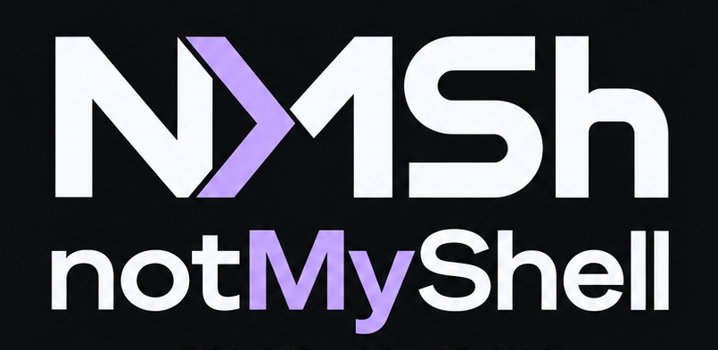
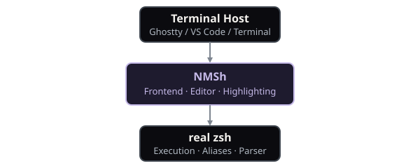
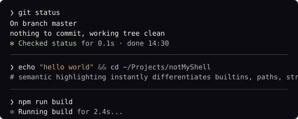

<div align="center">
  <picture>
    
  </picture>

  <p><b>A terminal frontend for your real shell.</b></p>

  <p>
    <a href="https://github.com/raiseCatError/notMyShell/blob/master/LICENSE"></a>
    
    
    
    <a href="https://github.com/raiseCatError/notMyShell/actions/workflows/ci.yml"></a>
  </p>
</div>

<br>

**notMyShell (NMSh)** is a terminal frontend for a real persistent zsh session. It adds a persistent bottom input editor, semantic syntax highlighting, autocomplete, scrollable history, and richer command feedback while preserving normal shell state, aliases, functions, environment, and PTY behavior.

Working on NMSh? See [AGENTS.md](AGENTS.md).

## Visual demo

<div align="center">
  
  <p><em>NMSh showing semantic highlighting, the pinned input bar, and live activity feedback.</em></p>
</div>

<br>
<div align="center">
  <picture>
    
  </picture>
</div>
<br>

## What is NMSh?

NMSh is **NOT** a replacement shell implementation, and it is **NOT** a terminal emulator.

It is a frontend that wraps your real zsh environment. NMSh owns the prompt, multiline input editor, syntax highlighting, and history presentation. Real zsh owns the parsing, command execution, aliases, and environment variables.

<div align="center">
  <picture>
    
  </picture>
</div>

## Why NMSh?

NMSh provides a richer interactive frontend without throwing away the proven robustness of a real shell parser. It brings a Claude Code-like interaction model to your daily shell:

- **Fixed bottom input:** A stable workspace that never jumps around.
- **Scrollable history:** Output history that doesn't disappear when you edit.
- **Rich editor:** True multiline input that acts like a text editor.
- **Preserved semantics:** Your real shell aliases, functions, and pipelines still work.

<br>
<div align="center">
  <picture>
    
  </picture>
</div>
<br>

## Features

### Shell
- Real zsh execution and parsing
- Real aliases, functions, and environment
- `zoxide` integration
- Completion bridge using real zsh completion data

### Editor
- Multiline input and selection
- Ghost autosuggestions from history
- **Semantic syntax highlighting** (differentiates executables, builtins, aliases, and functions instantly)

### Prompt
- NMSh Native prompt (default) with Lavender Native, Brand / Semantic, Cool First, Warm First, and Grayscale themes
- Independent Start / Connector / Connector fade / Gap / End geometry (wedge, flat, rounded, slanted, and fading outer edges), icons On/Off, and a module manager: `/prompt` → Main Prompt
- Rich Git state (staged, modified, untracked, conflicts, ahead/behind/diverged, operations, clean) with its own Enabled, Colors (Semantic default, Follow theme, Grayscale), Geometry, and Connector fade settings: `/prompt` → Rich Git
- Right-side prompt context: any module can sit left or right (`/prompt` → Modules, `P`); the right side mirrors its geometry to face left by default (`M`) and is the first thing to go on narrow terminals
- Show-on-command modules: Kubernetes and Docker context (and optionally toolchains) appear only while a relevant command such as `kubectl` or `docker` is typed; typed text is never executed to decide
- Width-aware path shortening keeps the repository name and current directory whole while abbreviating parents as the terminal narrows
- Terminal glyph style (Nerd Font or Safe/ASCII) is chosen on first run and can be changed in `/config` (Glyph style) or previewed under `/settings` → Settings → Glyph style. Existing v0.3 configurations keep Nerd Font styling; `NMSH_ICONS=nerd|safe` overrides the saved choice for the current process.
- Optional Starship or Powerlevel10k prompt providers; NMSh keeps the editor. The Starship module editor changes only reviewed settings, with a backup of an existing config.
- One-line or two-line composer layouts

### Interface
- Command lifecycle rows with activity animation and nested Node TAP activity
- Scrollable history with muted snapshots of each command's prompt; tune dividers and history colors with `/transcript`
- Smart output folding: long, repetitive successful output collapses to its first and last lines around `› N lines hidden · Ctrl+O`, while failures and useful output stay expanded; `/copy` and `/resume` always keep the full output (Config → Output folding: Smart / Never)
- Sticky command headers keep the current command visible while scrolling
- NMSh checkpoints the local presentation session during use; `/clear` starts a fresh view and `/resume` browses retained sessions without rewinding live zsh state
- `/zsh` hands off to an ordinary interactive zsh
- Rich paste atoms for large multiline pastes
- `/copy` and `/copy N` for instant clipboard access
- `/history` interactive search
- `/version`, `/appearance`, and `/keyboard` integrations
- `/settings` (alias `/config`) edits NMSh preferences and `/status` shows runtime status, while direct commands such as `/prompt` and `/transcript` remain available

### Interactive Apps
- Safe passthrough yielding for full-screen applications like `fzf`, `vim`, `nano`, and `less`.

<br>
<div align="center">
  <picture>
    
  </picture>
</div>
<br>

## Syntax Highlighting

Highlighting is entirely NMSh-native and non-blocking. A fast lexical layer tokenizes the input, while an asynchronous semantic bridge queries your real zsh environment to classify command tokens.

NMSh safely queries metadata (`whence -w`) and never executes partially typed input.

`/syntax` (also under `/settings` → Syntax) turns highlighting on or off and picks its colors: follow the prompt theme (default; with Starship or Powerlevel10k this means the saved NMSh Native palette), choose any Native theme independently, or Grayscale, which keeps categories apart through lightness, weight, and underline. Live preview rows show the result before saving. Submitted commands keep the look they were entered with; raw command output is never recolored and `/copy` stays plain text.

<div align="center">
  <picture>
    
  </picture>
</div>

<br>
<div align="center">
  <picture>
    
  </picture>
</div>
<br>

## Shell Compatibility

NMSh currently boots a real, controlled zsh instance.

**What works naturally:**
- Aliases, functions, PATH, and environment variables
- `zoxide` integration, pipelines, redirects, and external commands

**UI Plugin differences:**
- Foreign prompt rendering in the managed shell (Powerlevel10k, RPROMPT, ZLE prompts) is suppressed so it cannot fight NMSh. You can still choose Starship or Powerlevel10k as an NMSh prompt provider. Powerlevel10k's left prompt is rendered in an isolated helper, without its prompt character, gitstatus daemon, or right prompt.
- `zsh-autosuggestions` and `zsh-syntax-highlighting` are replaced by NMSh-native equivalents.
- Native `fzf-tab` integration is not currently supported; safe zsh completion/widget interoperability remains unresolved in [issue #52](https://github.com/raiseCatError/notMyShell/issues/52).

NMSh loads your `~/.zshrc` in a controlled sandbox to extract environment knowledge without letting UI plugins fight for terminal control.

See [ROADMAP.md](ROADMAP.md) for planned shell compatibility, multi-shell adapters, and future work.

## Installation

**Prerequisites:**
- macOS
- Node.js (v22+)
- zsh
- A compatible terminal host (Ghostty, macOS Terminal, VS Code)

Clone the repository and install dependencies:

```sh
git clone https://github.com/raiseCatError/notMyShell.git
cd notMyShell
npm install
npm run build
npm link
```

*(Note: Depending on your npm version, you may be prompted to allow lifecycle scripts required by `node-pty`. You can safely approve this or set `allowScripts` appropriately.)*

After linking, run the CLI from anywhere:

```sh
nmsh
```

### Updating

`/update` checks GitHub for the latest stable release and shows current → available, a short release summary, and the exact plan. `/update apply` then installs that release. NMSh updates a source checkout of this repository only when the checkout is clean, its `origin` is this repository, the fetched release tag matches the commit GitHub reports, and moving to the tag is a fast-forward. It then runs `npm install` and `npm run build` and verifies the new build identity. If anything fails, it restores the previous commit and rebuilds it. Otherwise it explains why and prints the manual steps. It never pulls arbitrary branches, discards changes, or touches your settings, transcripts, or shell profile. Restart NMSh afterwards to use the new version.

Background checks are off by default; turn them on in `/settings` → Config → Update checks (Daily or Weekly). When a newer release appears, you get one quiet line per release. No credentials or telemetry are involved.

## Ghostty Setup

For the most robust startup experience in Ghostty, configure it to run NMSh using absolute paths. GUI applications on macOS sometimes have unpredictable `PATH` resolution.

1. Find your absolute paths:
   ```sh
   command -v node
   command -v nmsh
   ```

2. Add the direct command to your Ghostty config (`~/.config/ghostty/config`):
   ```
   command = direct:/absolute/path/to/node /absolute/path/to/nmsh
   ```

Do not instruct macOS to change your default login shell to NMSh. NMSh is a frontend; zsh remains the underlying shell.

## Host Compatibility

| Host | Status | Notes |
|------|--------|-------|
| Ghostty | Primary | Full integration available (`/keyboard`, `/appearance`). |
| macOS Terminal | Supported | Shift+Enter works out of the box. |
| VS Code Integrated Terminal | Supported | `Shift+Enter` may require custom `keybindings.json` forwarding. Opacity/blur controls are not applicable. |

## Keyboard Behavior

- **Enter:** Submit command
- **Ctrl+J:** Portable multiline newline fallback
- **Shift+Enter (Ghostty/macOS Terminal):** Insert a newline in the editor
- **Option+Left/Right:** Move cursor by word
- **Option+Backspace:** Delete previous word (requires Ghostty forwarding setup)
- **Ctrl+W:** Delete previous word
- **Cmd+A:** Select all input (requires Ghostty forwarding setup)
- **Cmd+Up/Down:** Jump to top/bottom of buffer (requires Ghostty forwarding setup)
- **Shift+Left/Right:** Character selection
- **PageUp/PageDown:** Scroll output history

*(Note: In VS Code, Shift+Enter is often indistinguishable from Enter by default. Use Ctrl+J as a reliable multiline fallback.)*

### /keyboard & /appearance

Some advanced shortcuts (like Option+Backspace, Cmd+A) are normally consumed by the terminal host before NMSh sees them. The `/keyboard` slash command installs managed, opt-in forwarding rules exclusively into your Ghostty configuration. It does not alter any macOS system keybindings.

The `/appearance` slash command provides an interactive UI to adjust Ghostty's window background opacity, blur mode, and blur radius.

## Known Limitations

- **Mouse behavior:** Native mouse selection or Shift-drag behavior may feel different because NMSh enables mouse reporting.
- **ZLE widgets:** Certain complex third-party ZLE (Zsh Line Editor) widgets are not directly portable.
- **zsh grammar:** Syntax highlighting intentionally does not implement the entire, exhaustive zsh grammar; it focuses on providing fast semantic assistance for common command structures. Highlighting colors are theme-aware via `/syntax`.
- **Completion:** The completion bridge is not full parity with a configured interactive zsh, and native `fzf-tab` is not supported yet ([#52](https://github.com/raiseCatError/notMyShell/issues/52)).
- **Nested activity:** Only directly observed Node TAP v13 streams produce nested activity rows.
- **Powerlevel10k provider:** The right prompt, instant prompt, gitstatus daemon, and p10k settings defined only in `.zshrc` are not reproduced.

## Development

```sh
npm run build
npm run typecheck
npm test
git diff --check
```

## Community & Documentation

- **Contributing** → [CONTRIBUTING.md](CONTRIBUTING.md)
- **Security** → [SECURITY.md](SECURITY.md)
- **Roadmap** → [ROADMAP.md](ROADMAP.md)
- **Changelog** → [CHANGELOG.md](CHANGELOG.md)

See [ROADMAP.md](ROADMAP.md) for future multi-shell architecture and extensibility plans.

## Security & Privacy

- Everything executes locally on your machine through your local shell.
- No cloud backend is required.
- No telemetry is collected.
- Shell configuration reads from your local system securely.

## License

NMSh is licensed under the **GNU General Public License v3.0** (GPL-3.0-only). See the `LICENSE` file for details.
