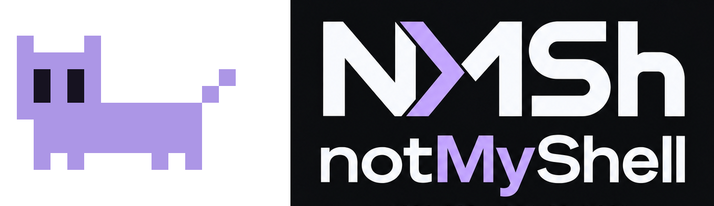

<div align="center">
  <picture>
    
  </picture>

  <p><b>A terminal frontend for your real shell.</b></p>

  <p>
    <a href="https://github.com/raiseCatError/notMyShell/blob/master/LICENSE"></a>
    
    
    
    <a href="https://github.com/raiseCatError/notMyShell/actions/workflows/ci.yml"></a>
  </p>
</div>

<br>

**notMyShell (NMSh)** runs your real zsh, Bash or Fish in a persistent session and gives it a better front end: a composer that stays put, semantic highlighting, a readable transcript, live command feedback, sessions that survive closing the window, and themes that can reach the tools you use.

Latest published stable release: [v0.17.0 — Context Engine, Themes & Discovery](https://github.com/raiseCatError/notMyShell/releases/tag/v0.17.0). The `master` branch includes this released work. See the [changelog](CHANGELOG.md#0170---2026-10-06) for its implemented scope.

## See notMyShell in motion

https://github.com/user-attachments/assets/7f2cbe74-ad86-4d13-bbe3-04e334cff81b

[Watch the 4K reel fullscreen → YouTube](https://youtu.be/zIzq_88R5OI) · [View the X post → X](https://x.com/raiseCatError/status/2107187652181303325?s=20)

Explore the [demo gallery](docs/demos.md) by feature.

## What NMSh is (and is not)

NMSh is a **frontend**. Your shell stays underneath and does what it always did: parsing, execution, aliases, functions, environment, job control. NMSh owns what you see and type: the composer and editor, completion and suggestions, history and transcript, prompt and layout, sessions, themes and Chroma, tool panels, and local guidance. Fullscreen and raw interactive terminal applications use the passthrough path; their input and display remain with the real program.

<div align="center">
  <picture>
    
  </picture>
</div>

- **Not a shell.** It does not reimplement zsh, Bash or Fish; it runs them.
- **Not a terminal emulator.** Keep Ghostty, Terminal.app, VS Code, Zed or whatever you use.
- **Not a prompt theme.** The Native prompt is optional; Starship, Oh My Posh or Powerlevel10k can supply the prompt instead, or none at all.
- **Not an AI terminal.** `/btw` (legacy alias `/ask`) maps plain requests onto typed NMSh actions locally, with an optional local model; nothing needs an account.

## Highlights

- **A composer that stays where you want it** — Bottom, Top or Flow (right after the newest output), one-line or two-line, with true multiline editing.
- **Semantic highlighting** — commands, builtins, aliases and functions are classified against your real shell as you type; partial input is never executed.
- **A transcript you can use** — command blocks with status and timing, folding for long output, `/find` and `/filter`, plain-text `/copy`.
- **Live sessions** — closing a window detaches the shell instead of killing it; running commands keep going. `/resume` or `nmsh --attach` brings them back.
- **Prompt providers** — NMSh Native (Powerline, Soft, Minimal, Outline styles), Starship, Oh My Posh, Powerlevel10k or None.
- **Theme Studio and Theme Bridge** — built-in, imported and custom themes in `/theme`; opt-in `/theme-bridge` carries the active theme to fzf, less/man, file listings, bat, tmux, Vim, Neovim and Helix through files NMSh owns and you review.
- **Curated tools** — `/tools` finds, explains and (on request) installs a short list of shell tools; `/providers` picks the picker, history, navigation and suggestion providers; `/tmux` and `/dotfiles` import settings safely.
- **Shell frameworks, handled carefully** — Oh My Zsh, Powerlevel10k, Prezto, Zim, zinit and Antidote are detected; shell config is treated as code, never as harmless data.
- **Keep Awake** — `/zoomies` (also `/caffeinate`, `/awake`) keeps the machine or display awake through the OS's own mechanism and shows that it is on, quietly.
- **Personality, optional** — Chroma color treatments, motion, screensavers and Vespyr, the NMSh cat. All of it respects Reduced Motion, Safe glyphs and `NO_COLOR`.

<div align="center">
  
</div>

## Native modules and the Context Engine

The current engineering focus is NMSh's native module ecosystem: trusted capabilities resolve contextual facts, modules turn those facts into presentation, and a Surface Router places them in the Main Prompt, Context Rail or Right Context.

v0.17.0 implements fact metadata, native module routing and the Context Rail. Installable, declarative Context Packs are upcoming; they are not an executable plugin API. Entering a repository must never execute arbitrary repository-controlled code through context discovery.

Read the [Context Modules guide](docs/architecture/context-modules.md) for the implemented surfaces, discovery boundaries and pack direction, or the [roadmap](ROADMAP.md#current-engineering-focus--native-modules-and-context-engine) for what remains.

## Visual tour

A workspace that stays readable. A palette that feels like yours. Explore the full recordings by chapter, from first setup to returning to a running session.

<details>
<summary>Composer and live feedback walkthrough</summary>

<div align="center">
  
  <p><em>Typing with semantic highlighting, live command feedback, and a theme change from <code>/theme</code>. Recorded from the real binary with <a href="scripts/demos/README.md">VHS</a>.</em></p>
</div>

</details>

<p align="center">
  <a href="docs/demos.md#theme-studio"></a>
</p>

<p align="center"><a href="docs/demos.md#theme-studio"><b>Your palette</b> — Theme Studio</a></p>

| Explore | What you’ll see |
| --- | --- |
| [Customization](docs/demos.md#customization) | Setup Cat, composer layouts, prompt styles, theme families and syntax previews |
| [Color and motion](docs/demos.md#color-and-motion) | Chroma gradients, live feedback, every screensaver, Vespyr and raiseCatError |
| [Tools and shells](docs/demos.md#tools-and-shells) | Ask, provider choices, checked tools, Theme Bridge, Fish and real Vim |
| [Sessions](docs/demos.md#sessions) | Detach, reattach and Keep Awake |

[Full demo gallery](docs/demos.md) · [Detailed runtime diagram](assets/readme/architecture-detailed.svg)

The gallery uses wide, opaque recordings from the real NMSh build, with a disposable home and neutral demo identity. [Committed tapes](scripts/demos/README.md) reproduce every clip.

## Install

### Homebrew

Homebrew is the recommended install method on macOS.

```sh
brew install raiseCatError/tap/nmsh
nmsh
```

To uninstall the Homebrew package:

```sh
brew uninstall nmsh
```

### Build from source

You need:

- macOS, Linux (beta: automated CI on Ubuntu and Fedora, not yet physically validated) or Windows through WSL 2 ([platforms](docs/architecture/platforms.md))
- Node.js 22 or newer
- zsh (default), and optionally Bash 4.4+ or Fish

```sh
git clone https://github.com/raiseCatError/notMyShell.git
cd notMyShell
npm install
npm run build
npm link
nmsh
```

npm may ask to allow `node-pty`'s install script; it is required. To start NMSh from Ghostty or another GUI terminal, use absolute paths so macOS `PATH` differences cannot break startup:

```
command = direct:/absolute/path/to/node /absolute/path/to/nmsh
```

Do not set `nmsh` as your system/login shell with `chsh`. Keep zsh, Bash or Fish as your real shell. If you want NMSh to open automatically, configure your terminal app (for example Ghostty or Zed) to launch `nmsh` instead.

**Updating:** For Homebrew installations, use `brew upgrade raiseCatError/tap/nmsh`; `/update` directs you to Homebrew rather than changing files in the Cellar. For source installations, `/update` shows the latest stable release and the exact plan; `/update apply` installs it into a clean official source checkout, verifies the build, and rolls back on failure. Automatic updates (Automatic / Notify only / Off) use the same checks.

**Moving and removing:** `nmsh config export` / `nmsh config import FILE` move settings between machines (preview first, no history or secrets); for source installations, `nmsh uninstall` removes only NMSh's own launcher links (use `brew uninstall nmsh` for Homebrew packages); `nmsh doctor` prints a diagnostic for bug reports.

## Core commands

Type `/` in the composer for the full list, or `/help` for everything grouped by area. The ones you will reach for most:

| Area | Commands |
| --- | --- |
| Settings and setup | `/settings` (`/config`), `/setup`, `/palette` (F1), `/help`, `/status` |
| Composer and prompt | `/prompt`, `/layout` (`/composer`), `/transcript`, `/syntax`, `/cursor` |
| Look and motion | `/appearance`, `/theme`, `/theme-bridge`, `/chroma`, `/motion`, `/chrome`, `/glyphs`, `/strip`, `/screensaver` |
| Tools | `/tools`, `/providers`, `/configure`, `/tmux`, `/integrations`, `/dotfiles` |
| Sessions and history | `/resume`, `/sessions`, `/history`, `/find`, `/filter`, `/copy`, `/clear` |
| Shells | `/shell` (switch zsh / Bash / Fish in place), `/zsh` (hand off to an ordinary shell) |
| Everyday extras | `/btw`, `/watch`, `/open`, `/zoomies` (`/caffeinate`, `/awake`), `/update`, `/doctor` |

### Keep Awake

`/caffeinate`, `/awake` and `/zoomies` are the same feature:

```text
/zoomies                 open the panel (starts nothing by itself)
/zoomies display         keep the display and the machine awake until stopped
/zoomies system 2h       prevent system sleep for two hours
/zoomies status          mode, backend, start time, timeout
/zoomies stop            end it
```

It uses the operating system's own mechanism: Apple `caffeinate` on macOS, a systemd inhibitor on Linux (idle and sleep only; the inhibitor is not a display API, so Display is shown as unavailable there), and the `SetThreadExecutionState` API on Windows. The assertion is an NMSh-owned background process, so the prompt comes straight back; it keeps running after the window closes and ends on `stop` or its timeout. Typing `caffeinate` yourself is still an ordinary shell command. While it is active, NMSh shows `Awake · <mode>` on a free composer edge (or a row next to the composer), in the Status Strip when that is on, and optionally on the screensaver; nothing shows while it is off. Power settings are never changed, and `/zoomies stop` only stops what NMSh can prove it started.

## Compatibility

**Shells.** zsh (default), Bash 4.4+ and Fish run behind one [ShellAdapter](docs/architecture/shell-adapter.md); the composer, transcript, sessions, prompt, themes and completion menu work over each, and `/shell` switches the current session in place. NMSh loads your startup files in a controlled bootstrap and never edits them. ZLE prompt and widget UI (Powerlevel10k's in-shell prompt, zsh-autosuggestions, zsh-syntax-highlighting) is kept off inside NMSh so it cannot fight the composer; those plugins keep working in `/zsh` and ordinary shells. Native `fzf-tab` is not supported ([#52](https://github.com/raiseCatError/notMyShell/issues/52)).

**Shell frameworks and prompt providers.** They are different things, and NMSh treats them differently:

| | What it is | What NMSh does |
| --- | --- | --- |
| Oh My Zsh | Zsh framework | Detects it; guided install that keeps your `.zshrc` (you run the official installer); compares and can restore `.zshrc.pre-oh-my-zsh` after a backup and confirmation |
| Powerlevel10k | Zsh prompt theme | Optional prompt provider rendered in an isolated helper; `p10k configure` on request |
| Starship, Oh My Posh | Cross-shell prompt engines | Optional prompt providers run directly by NMSh, no rc changes |
| Prezto, Zim, zinit, Antidote | Zsh ecosystem tools | Detected and shown, inspect-only |

NMSh never sources or installs framework code on its own, and never merges shell configuration.

**Terminals.** NMSh is host-independent. Zed, VS Code, Ghostty and Terminal.app are used daily during development, and Ghostty and Terminal.app are physically validated; Kitty, iTerm2, WezTerm and Windows Terminal (through WSL) have capability profiles covered by CI fixtures but have not had the same physical QA. Hosts differ in keyboard and mouse reporting — see [terminal host](docs/architecture/terminal-host.md) and [HostActions](docs/architecture/host-actions.md) for details, and `/keyboard` for Ghostty key forwarding (Option+Backspace, Cmd+A).

**Accessibility.** Safe/ASCII glyphs (`/glyphs`), `NO_COLOR`, 256-color terminals and Reduced Motion are first-class: meaning never depends on color or icons alone, and motion stops when you ask it to. See [accessibility](docs/accessibility/).

## Safety and ownership

- Everything runs locally. No account, no telemetry, no cloud backend ([privacy](docs/privacy.md)).
- **Your shell config is code.** NMSh does not edit rc files behind your back. The few changes it can make on request (for example a Theme Bridge include, or restoring a backed-up `.zshrc`) are shown as an exact diff and wait for your confirmation.
- **Imports are data.** Theme files are parsed with bounded data parsers; nothing is sourced, templated or fetched. `/dotfiles` never runs anything from a repository; it imports supported settings and leaves executable configs inspect-only.
- **NMSh owns what it writes, and only that.** Generated files are recorded in an ownership ledger and are replaced or removed only while they still match what NMSh wrote. Keep Awake stops only the process it can prove it started.
- **Installs are explicit.** `/tools` shows the exact package-manager command and asks first; nothing elevates silently.

See [SECURITY.md](SECURITY.md) to report a vulnerability.

## Known limitations

- The completion bridge is close to, but not full parity with, a configured interactive zsh.
- Highlighting covers common command structure, not the entire zsh grammar.
- Powerlevel10k's right prompt, instant prompt and gitstatus daemon are not reproduced by the provider.
- Theme Bridge recolors new tool instances; editors and shells already running outside NMSh are not recolored live. delta is never managed (NMSh leaves git config alone); its syntax highlighting follows bat's NMSh theme through `BAT_THEME` unless your git config pins it, and its diff colors stay yours. Terminal title ownership (OSC 0/2) is not implemented.
- Hosts without mouse reporting scroll the transcript with PageUp/PageDown.

## Documentation

- [Architecture](ARCHITECTURE.md) — how NMSh works end to end, in plain language; deeper docs live under `docs/architecture/` and `docs/design/`
- [Context Modules](docs/architecture/context-modules.md) — facts, routing, Context Rail and declarative pack direction
- [Demo gallery](docs/demos.md) — every feature clip in one place
- [ShellAdapter](docs/architecture/shell-adapter.md), [platforms](docs/architecture/platforms.md), [terminal stack](docs/architecture/terminal-stack.md)
- [Themes, imports and Theme Bridge](docs/design/theme-bridge.md), [Chroma and UI chrome](docs/design/chroma-and-ui-chrome.md), [idle visuals](docs/design/idle-visuals.md)
- [Roadmap](ROADMAP.md) · [Changelog](CHANGELOG.md) · [Support](SUPPORT.md)

## Development

```sh
npm run verify:fast   # build + core tests (iteration)
npm run verify        # build + full suite
npm run demos         # re-record the README clips with VHS (see scripts/demos/README.md)
```

Contributor and agent guidance: [CONTRIBUTING.md](CONTRIBUTING.md) and [AGENTS.md](AGENTS.md). `NMSH_DETERMINISTIC=1` makes presentation repeatable for tests and recordings ([deterministic presentation](docs/testing/deterministic-presentation.md)).

## License

NMSh is licensed under the **GNU General Public License v3.0** (GPL-3.0-only). See [LICENSE](LICENSE).
