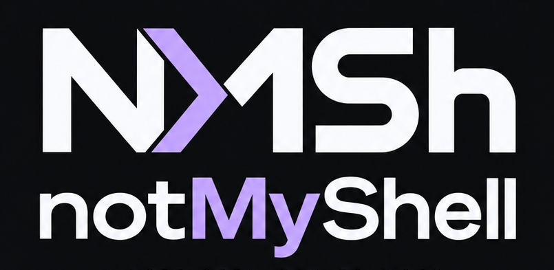
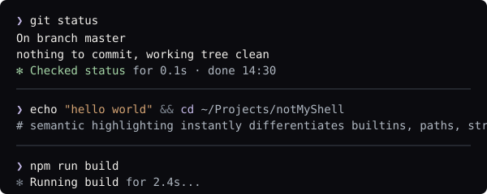

<div align="center">
  <picture>
    
  </picture>

  <p><b>A terminal frontend for your real shell.</b></p>

  <p>
    <a href="https://github.com/raiseCatError/notMyShell/blob/master/LICENSE"></a>
    
    
    
    <a href="https://github.com/raiseCatError/notMyShell/actions/workflows/ci.yml"></a>
  </p>
</div>

<br>

**notMyShell (NMSh)** is a terminal frontend for a real persistent zsh session. It adds a persistent bottom input editor, semantic syntax highlighting, autocomplete, scrollable history, and richer command feedback while preserving normal shell state, aliases, functions, environment, and PTY behavior.

Current stable release: [v0.16.0 — Sessions, Agents & Portability](https://github.com/raiseCatError/notMyShell/releases/tag/v0.16.0).

Working on NMSh? See [AGENTS.md](AGENTS.md).

## Visual demo

<div align="center">
  
  <p><em>NMSh showing semantic highlighting, the pinned input bar, and live activity feedback.</em></p>
</div>

<br>
<div align="center">
  <picture>
    
  </picture>
</div>
<br>

## What is NMSh?

NMSh is **NOT** a replacement shell implementation, and it is **NOT** a terminal emulator.

It is a frontend that wraps your real zsh environment. NMSh owns the prompt, multiline input editor, syntax highlighting, and history presentation. Real zsh owns the parsing, command execution, aliases, and environment variables.

<div align="center">
  <picture>
    
  </picture>
</div>

## Why NMSh?

NMSh provides a richer interactive frontend without throwing away the proven robustness of a real shell parser. It brings a Claude Code-like interaction model to your daily shell:

- **Fixed bottom input:** A stable workspace that never jumps around.
- **Scrollable history:** Output history that doesn't disappear when you edit.
- **Rich editor:** True multiline input that acts like a text editor.
- **Preserved semantics:** Your real shell aliases, functions, and pipelines still work.

<br>
<div align="center">
  <picture>
    
  </picture>
</div>
<br>

## Features

### Shell
- Real zsh execution and parsing
- Real aliases, functions, and environment
- `zoxide` integration
- Completion bridge using real zsh completion data

### Editor
- Multiline input and selection
- Predictive ghost suggestions (NMSh Native: fuzzy, frecency, directory, and sequence ranking; optional Deja provider): → accepts, Alt+→ accepts a word, Ctrl+N / Ctrl+P show alternatives, Esc dismisses
- **Semantic syntax highlighting** (differentiates executables, builtins, aliases, and functions instantly)

### Prompt
- NMSh Native prompt (default) with Lavender Native, Brand / Semantic, Cool First, Warm First, and Grayscale themes
- Independent Start / Connector / Connector fade / Gap / End geometry (wedge, flat, rounded, slanted, and fading outer edges), icons On/Off, and a module manager: `/prompt` → Main Prompt
- Rich Git state (staged, modified, untracked, conflicts, ahead/behind/diverged, operations, clean) with its own Enabled, Colors (Semantic default, Follow theme, Grayscale), Geometry, and Connector fade settings: `/prompt` → Rich Git
- Right-side prompt context: any module can sit left or right (`/prompt` → Modules, `P`); the right side mirrors its geometry to face left by default (`M`) and is the first thing to go on narrow terminals
- Show-on-command modules: Kubernetes and Docker context (and optionally toolchains) appear only while a relevant command such as `kubectl` or `docker` is typed; typed text is never executed to decide
- Width-aware path shortening keeps the repository name and current directory whole while abbreviating parents as the terminal narrows
- Terminal glyph style (Nerd Font or Safe/ASCII) is chosen on first run and can be changed in `/config` (Glyph style) or previewed under `/settings` → Settings → Glyph style. Existing v0.3 configurations keep Nerd Font styling; `NMSH_ICONS=nerd|safe` overrides the saved choice for the current process.
- Optional Starship or Powerlevel10k prompt providers; NMSh keeps the editor. The Starship module editor changes only reviewed settings, with a backup of an existing config.
- Prompt provider **None**: composer only (no prompt row, modules, right prompt or marker); everything else in NMSh keeps working
- Native prompt styles: Powerline, Soft, Minimal, Outline (`/prompt` → Style)
- One-line or two-line composer layouts

### Interface
- Command lifecycle rows with activity animation and nested Node TAP activity
- Scrollable history with muted snapshots of each command's prompt, shown Full, Compact, Minimal or Off; tune dividers and history colors with `/transcript`
- Native theme library: `/theme` (Theme Studio) browses Built-in themes and manages Imported and Custom ones; import NMSh Theme JSON, Base16, Base24, Windows Terminal, Oh My Posh (JSON/YAML/TOML), Kitty, Ghostty, iTerm2 or WezTerm TOML files as data only, with a preview and loss disclosure before anything is saved
- Theme Bridge (`/theme-bridge`, opt-in per tool): fzf launched by NMSh, less/man, LS_COLORS, tmux, Neovim and Vim can Follow NMSh or use a pinned theme; nothing changes for a tool until you choose, and config includes are shown and confirmed first
- Host cooperation on capable terminals: OSC 7 working directory and OSC 133 command zones derived from NMSh's own command lifecycle, and NMSh-authored OSC 8 links (help, docs, dev-server URLs) kept separate from program output
- Output folding (Config → Output folding: Off / Smart / Always): long output collapses to its first and last lines around `› N lines hidden · Ctrl+O`; Smart keeps failures and useful output expanded; `/copy` and `/resume` always keep the full output
- Composer position Bottom, Top, or Flow (Config → Composer position). Flow places the prompt and input right after the newest output, like a conventional terminal, and they scroll with it. Combine any position with Normal or Chat transcript presentation (Config → Transcript presentation). `/layout` (also Config → Layout) previews every combination with sample content before you choose.
- Welcome providers: Vespyr (default), Fastfetch, Neofetch (legacy, if installed), or None (`/settings` → Welcome)
- Command palette: `/palette`, F1, or Ctrl+Shift+P (Cmd+Shift+P where the terminal reports it) to search NMSh commands, settings, and actions
- Sticky command headers keep the current command visible while scrolling
- **Live sessions:** closing a window detaches its shell instead of ending it, and running commands keep going. Come back through the startup prompt (Config → Sessions: Ask, Always or Never), `/resume` (LIVE sessions with their status, above archived transcripts), or `nmsh --attach <id>` (`nmsh --sessions` lists them). `exit`, Ctrl+D and `/zsh` end a session.
- NMSh checkpoints the local presentation session during use; `/clear` starts a fresh view and `/resume` browses retained sessions without rewinding live zsh state
- `/zsh` hands off to an ordinary interactive zsh
- Rich paste atoms for large multiline pastes
- `/copy` and `/copy N` for instant clipboard access
- `/history` interactive search
- `/version`, `/appearance`, and `/keyboard` integrations
- `/settings` (alias `/config`) edits NMSh preferences and `/status` shows runtime status, while direct commands such as `/prompt` and `/transcript` remain available

### Interactive Apps
- Safe passthrough yielding for full-screen applications like `fzf`, `vim`, `nano`, and `less`.

<br>
<div align="center">
  <picture>
    
  </picture>
</div>
<br>

## Syntax Highlighting

Highlighting is entirely NMSh-native and non-blocking. A fast lexical layer tokenizes the input, while an asynchronous semantic bridge queries your real zsh environment to classify command tokens.

NMSh safely queries metadata (`whence -w`) and never executes partially typed input.

`/syntax` (also under `/settings` → Syntax) turns highlighting on or off and picks its colors: follow the prompt theme (default; with Starship or Powerlevel10k this means the saved NMSh Native palette), choose any Native theme independently, or Grayscale, which keeps categories apart through lightness, weight, and underline. Live preview rows show the result before saving. Submitted commands keep the look they were entered with; raw command output is never recolored and `/copy` stays plain text.

<div align="center">
  <picture>
    
  </picture>
</div>

<br>
<div align="center">
  <picture>
    
  </picture>
</div>
<br>

## Shell Compatibility

NMSh runs a real, persistent shell underneath and keeps it: zsh (default), Fish, or Bash 4.4+. The same composer, transcript, sessions, prompt UI, Settings, Chroma, history presentation and completion menu work over each. `/shell` lists what is installed and switches the current session in place (same session, cwd and transcript); Settings → Default shell chooses the shell for new sessions. NMSh never installs a shell. See [ShellAdapter](docs/architecture/shell-adapter.md) for exactly what differs (for example, Bash completion has no descriptions).

**What works naturally:**
- Aliases, functions, PATH, and environment variables
- `zoxide` integration, pipelines, redirects, and external commands

**No plugin manager required.** NMSh provides its editor, completion menu, prompt, transcript and sessions itself. Existing frameworks and plugin managers (Oh My Zsh, Antidote, Zinit, Fisher, …) can keep providing compatible shell-level functionality; `/status` and `nmsh doctor` show what is detected and how it relates to NMSh.

**UI Plugin differences:**
- Foreign prompt rendering in the managed shell (Powerlevel10k, RPROMPT, ZLE prompts, Fish prompts) is suppressed so it cannot fight NMSh. You can still choose Starship or Powerlevel10k as an NMSh prompt provider. Powerlevel10k's left prompt is rendered in an isolated helper, without its prompt character, gitstatus daemon, or right prompt.
- `zsh-autosuggestions` and `zsh-syntax-highlighting` draw through ZLE, which NMSh keeps off; NMSh's own suggestions and highlighting are shown instead, and the plugins keep working in `/zsh` and ordinary zsh.
- Native `fzf-tab` integration is not currently supported; safe zsh completion/widget interoperability remains unresolved in [issue #52](https://github.com/raiseCatError/notMyShell/issues/52).

NMSh loads your own shell startup files in a controlled bootstrap and never edits them.

See [ROADMAP.md](ROADMAP.md) for planned work (Nushell and native Windows are later).

## Installation

**Prerequisites:**
- macOS, or Linux (beta: tested in CI on Ubuntu and Fedora; not physically validated), or Windows through WSL 2 (see [platforms](docs/architecture/platforms.md))
- Node.js (v22+)
- zsh (Fish and Bash 4.4+ are optional additional backends)
- A compatible terminal host: an integrated terminal (such as Zed or VS Code) or a standalone terminal (such as Ghostty or macOS Terminal)

Clone the repository and install dependencies:

```sh
git clone https://github.com/raiseCatError/notMyShell.git
cd notMyShell
npm install
npm run build
npm link
```

*(Note: Depending on your npm version, you may be prompted to allow lifecycle scripts required by `node-pty`. You can safely approve this or set `allowScripts` appropriately.)*

After linking, run the CLI from anywhere:

```sh
nmsh
```

### Moving settings and uninstalling

- `nmsh config export` / `nmsh config import FILE` move your settings between machines, hosts and shells (versioned JSON, preview before apply, selectable categories; no history or secrets). See [portability](docs/design/v016-portability-uninstall-diagnostics.md).
- `nmsh uninstall` previews and removes only NMSh's own launcher links; your settings are kept unless `--delete-data`, and your shell config is never touched.
- `nmsh doctor` prints a short diagnostic for issue reports.

### Updating

`/update` checks GitHub for the latest stable release and shows current → available, a short release summary, and the exact plan. `/update apply` then installs that release. NMSh updates a source checkout of this repository only when the checkout is clean, its `origin` is this repository, the fetched release tag matches the commit GitHub reports, and moving to the tag is a fast-forward. It then runs `npm install` and `npm run build` and verifies the new build identity. If anything fails, it restores the previous commit and rebuilds it. Otherwise it explains why and prints the manual steps. It never pulls arbitrary branches, discards changes, or touches your settings, transcripts, or shell profile. Restart NMSh afterwards to use the new version.

Config → Automatic updates is Automatic, Notify only or Off, with a Daily or Weekly check frequency. New installs default to Automatic / Daily; saved Daily/Weekly notification preferences migrate to Notify only, Off stays Off. Automatic only prepares a verified stable release on an official, clean source checkout (the same checks `/update apply` makes, with the same rollback); the running session keeps its version and the new one starts on the next launch. Anything that cannot be proven safe gets one quiet notice and the manual steps. No credentials or telemetry are involved.

## Ghostty Setup

For the most robust startup experience in Ghostty, configure it to run NMSh using absolute paths. GUI applications on macOS sometimes have unpredictable `PATH` resolution.

1. Find your absolute paths:
   ```sh
   command -v node
   command -v nmsh
   ```

2. Add the direct command to your Ghostty config (`~/.config/ghostty/config`):
   ```
   command = direct:/absolute/path/to/node /absolute/path/to/nmsh
   ```

Do not instruct macOS to change your default login shell to NMSh. NMSh is a frontend; zsh remains the underlying shell.

## Host Compatibility

Keep your terminal. Keep your shell. Upgrade the interaction layer. NMSh is intentionally terminal-host independent: you can move between integrated terminals, standalone terminals and different hosts and keep the same NMSh interaction layer. No host is required or preferred.

- **Integrated terminals** are a first-class NMSh use case. Integrated terminals such as Zed and VS Code are regularly used during development and receive frequent real-world testing.
- **Standalone terminals** are equally first-class. Standalone terminals such as Ghostty and macOS Terminal are also regularly used and physically validated.
- **Other compatible hosts** are supported where NMSh's terminal capabilities allow, but some have not yet received the same level of physical validation.

*Supported* means NMSh is designed to work with the host's capability profile; *physically validated* means a real manual QA pass has been completed on that host.

| Host | Kind | Notes |
|------|------|-------|
| Zed | Integrated | Wheel/trackpad scrolling of the transcript through standard SGR mouse reporting; Shift keeps Zed's own text selection. Appearance is configured by Zed. Additional sessions use `/resume` or `nmsh --attach`. |
| VS Code | Integrated | `Shift+Enter` may require custom `keybindings.json` forwarding. Opacity/blur controls are not applicable. |
| Ghostty | Standalone | `/keyboard` and `/appearance` integration, new windows for sessions. |
| macOS Terminal | Standalone | Shift+Enter works out of the box; keyboard scrolling (PageUp/PageDown). |
| Kitty | Capability profile (CI fixtures) | Kitty keyboard protocol, mouse reporting and graphics are assumed only from the profile plus protocol replies; new windows need `allow_remote_control`. Not physically validated. |
| iTerm2 | Capability profile (CI fixtures) | Mouse, hyperlinks and image protocol from the profile; new windows through AppleScript. Not physically validated. |
| WezTerm | Capability profile (CI fixtures) | Same as iTerm2 for images; new windows through `wezterm cli spawn`. Not physically validated. |
| Windows Terminal (via WSL) | Capability profile (CI fixtures) | Detected from `WT_SESSION`; mouse, hyperlinks and truecolor only. Not physically validated. |
| Unknown or embedded hosts | Generic | Baseline capabilities, upgraded only by protocol replies. |

NMSh owns terminal-native interaction; the editor around it owns editor-native interaction. `/find` and `/filter` search and filter the transcript; `/open path:line:col` and `/open-diff a b` hand files to Zed or VS Code (or `$VISUAL`/`$EDITOR`) instead of rebuilding an editor inside the terminal. See [product boundary and HostActions](docs/architecture/host-actions.md). Inline images (`/about`) appear only where the host implements Kitty graphics or iTerm2 images ([image surface](docs/architecture/image-surface.md)).

Where a host differs, NMSh says so factually (for example, "Appearance is configured by Zed."). Host profiles only supply conservative capability hints, and optional protocols still come from the shared probe.

## Keyboard Behavior

- **Enter:** Submit command
- **Ctrl+J:** Portable multiline newline fallback
- **Shift+Enter (Ghostty/macOS Terminal):** Insert a newline in the editor
- **Option+Left/Right:** Move cursor by word
- **Option+Backspace:** Delete previous word (requires Ghostty forwarding setup)
- **Ctrl+W:** Delete previous word
- **Cmd+A:** Select all input (requires Ghostty forwarding setup)
- **Cmd+Up/Down:** Jump to top/bottom of buffer (requires Ghostty forwarding setup)
- **Shift+Left/Right:** Character selection
- **Up/Down:** Recall previous/next submitted commands when the caret is on the first/last editor line; Down past the newest restores your unsent draft. Multiline drafts move by line first. A completion or slash-command menu is entered with Down; Up from its first row returns to history. Panels and /history, /dirs keep their own Up/Down.
- **Ctrl+F:** Find in the transcript (adds a term; terms AND together). `/find` does the same; Cmd+F stays the host's own find.
- **PageUp/PageDown, mouse wheel:** Scroll output history

*(Note: In VS Code, Shift+Enter is often indistinguishable from Enter by default. Use Ctrl+J as a reliable multiline fallback.)*

### /keyboard & /appearance

Some advanced shortcuts (like Option+Backspace, Cmd+A) are normally consumed by the terminal host before NMSh sees them. The `/keyboard` slash command installs managed, opt-in forwarding rules exclusively into your Ghostty configuration. It does not alter any macOS system keybindings.

The `/appearance` slash command provides an interactive UI to adjust Ghostty's window background opacity, blur mode, and blur radius.

## Known Limitations

- **Mouse behavior:** Native mouse selection or Shift-drag behavior may feel different because NMSh enables mouse reporting.
- **Hosts without mouse reporting:** on baseline hosts (for example Terminal.app) scroll the transcript with PageUp/PageDown. A host setting that turns wheel scrolling into arrow keys on the alternate screen makes the wheel walk command history instead.
- **ZLE widgets:** Certain complex third-party ZLE (Zsh Line Editor) widgets are not directly portable.
- **zsh grammar:** Syntax highlighting intentionally does not implement the entire, exhaustive zsh grammar; it focuses on providing fast semantic assistance for common command structures. Highlighting colors are theme-aware via `/syntax`.
- **Completion:** The completion bridge is not full parity with a configured interactive zsh, and native `fzf-tab` is not supported yet ([#52](https://github.com/raiseCatError/notMyShell/issues/52)).
- **Nested activity:** Only directly observed Node TAP v13 streams produce nested activity rows.
- **Powerlevel10k provider:** The right prompt, instant prompt, gitstatus daemon, and p10k settings defined only in `.zshrc` are not reproduced.
- **Theme Bridge:** already-running editors and shells outside NMSh are not recolored live; bat and delta are detected but stay Independent (their custom themes need bat's cache or git config, which NMSh does not modify). Terminal title ownership (OSC 0/2) is not implemented.

## Development

```sh
npm run build
npm run typecheck
npm test
git diff --check
```

## Community & Documentation

- **Contributing** → [CONTRIBUTING.md](CONTRIBUTING.md)
- **Security** → [SECURITY.md](SECURITY.md)
- **Roadmap** → [ROADMAP.md](ROADMAP.md)
- **Changelog** → [CHANGELOG.md](CHANGELOG.md)

See [ROADMAP.md](ROADMAP.md) for future multi-shell architecture and extensibility plans.

## Security & Privacy

- Everything executes locally on your machine through your local shell.
- No cloud backend or account is required.
- No telemetry is collected; agent activity stats and session notices are local, optional and never contain prompts or output.
- NMSh never edits your shell configuration. See [docs/privacy.md](docs/privacy.md).

## License

NMSh is licensed under the **GNU General Public License v3.0** (GPL-3.0-only). See the `LICENSE` file for details.
