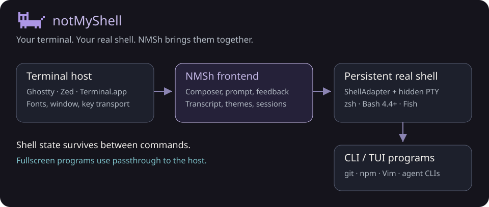

# NMSh Terminal Stack

This document defines the terminology used throughout NMSh's codebase and documentation. Understanding the four-layer stack is essential for contributing to NMSh without breaking its core invariants.

## The Stack

```
Terminal Host / Terminal Emulator
          ↓
       NMSh frontend
          ↓
    SessionClient → persistent shell PTY
          ↓
  CLI / TUI programs
```



[Detailed runtime flow](../../assets/readme/architecture-detailed.svg) shows geometry, helpers, session transport and passthrough.

NMSh sits between the terminal host and the shell. It does not replace either.

---

## Terminal Host / Terminal Emulator

The terminal host is the windowed application that renders the terminal UI and manages the physical display.

**Examples**

- Ghostty
- macOS Terminal.app
- iTerm2
- Kitty
- WezTerm

**Responsibilities**

- Terminal rendering (cells, fonts, cursor)
- ANSI/VT sequence interpretation
- Window management and chrome
- Keyboard protocol transport (including enhanced protocols such as the Kitty keyboard protocol)
- Alternate screen rendering
- Mouse reporting
- Optional: appearance integration, graphics protocols, transparency

**NMSh relationship**

NMSh receives its input and renders its output through the terminal host. NMSh core must remain **terminal-host agnostic** — it must not structurally depend on any specific host. Enhanced capabilities (keyboard protocols, appearance integration) are gated behind a TerminalHost capability abstraction.

---

## PTY — Pseudo-Terminal

A pseudo-terminal (PTY) is the terminal-like communication channel between processes. It consists of a master/slave pair: the master is held by the controller process (NMSh), and the slave is presented to the child process (the shell) as if it were a real terminal device.

The PTY is what makes the shell behave as though it is running in an interactive terminal, giving NMSh full control over its input and output streams while preserving ordinary terminal behavior.

NMSh creates and holds a persistent PTY for the selected shell. This PTY remains open for the entire NMSh session — commands are sent to the shell through it, and raw output flows back through it.

---

## Shell

The shell is the command interpreter and environment manager running inside NMSh's PTY.

**Supported shells**

zsh (default), Bash 4.4+ and Fish share the [ShellAdapter contract](shell-adapter.md). `/shell` switches the current session; Nushell and PowerShell remain future work.

**Shell responsibilities**

- Command parsing, expansion, and evaluation
- Pipes, redirections, and job control
- Aliases, functions, and environment variables
- Current working directory (cwd)
- History management
- Launching and managing child processes
- Shell scripting

**NMSh relationship**

NMSh does not reimplement the shell. It sends user input to the selected shell through the PTY and receives raw output back. The shell's state (cwd, environment, aliases, functions, history) is real and persistent across commands. NMSh queries it where needed but does not own it.

---

## NMSh

NMSh is the interactive frontend layer between the terminal host and the shell.

**Responsibilities**

- **Persistent editor** — A composer docked Bottom or Top, or in Flow after the newest output; one-line or two-line
- **Semantic highlighting** — Lexical and asynchronous semantic analysis of user input as it is typed
- **Autocomplete** — Real-time completion hints powered by the real shell's completion system
- **Command presentation** — Submitted commands retain their semantic highlighting in history
- **Structured history** — Scrollable viewport of past commands and raw PTY output
- **Execution lifecycle UI** — Animated activity, elapsed time, and factual timeline rows for running commands
- **Output folding** — Collapsed/expanded presentation state per command entry
- **Passthrough coordination** — Routing fullscreen/interactive programs through the PTY without NMSh interference
- **Prompt/context presentation** — Evaluated from the shell and displayed alongside the composer

**NMSh is NOT**

- A replacement terminal host. NMSh parses bounded ANSI/VT output into its transcript screen model; fullscreen applications use raw passthrough to the host
- A shell implementation (the selected shell remains authoritative)
- A shell that requires AI (normal editing and execution need no inference)
- A replacement for useful CLI tools (gh, zoxide, Atuin, tmux, vim, etc.)
- An IDE

---

## CLI / TUI Programs

These are the programs users actually run — launched by the shell, appearing in NMSh's output viewport or passthrough screen.

**Ordinary CLI examples**

git, gh, npm, pnpm, eza, brew, curl, jq, ripgrep

**Shell augmentation examples**

zoxide (smart directory navigation), Atuin (history search), fzf (fuzzy finder)

**Interactive TUI examples**

nano, vim, lazygit, btop, fzf, less, top

**Terminal multiplexers**

tmux — NMSh must not assume ordinary command rendering applies inside nested terminal environments.

**Agent CLIs**

Claude Code, Codex, OpenCode, Aider — these own their own interfaces and require PASSTHROUGH from NMSh.

**NMSh relationship**

NMSh provides the surrounding interaction and presentation layer. It does not replace the functionality of any of these tools. The design principle is:

> NMSh interoperates with useful CLI tools rather than recreating their functionality.

---

## Zero-AI Core Experience

NMSh's core experience requires:

- Zero LLM tokens
- Zero model API calls
- Zero cloud inference
- No network dependency for presentation logic

The UI may feel intelligent through deterministic local logic — semantic highlighting, output classification, factual timeline rows — but none of it involves inference or generation.

`/ask` provides local typed guidance and actions. Optional local understanding and agent integrations are separate from command execution. Normal NMSh operation remains fully functional offline.
