# NMSh demo gallery

Four chapters of real NMSh: make it yours, see it move, work with your tools, and return to your sessions. Each chapter opens with a featured recording; expand the walkthroughs for the rest.

[Customization](#customization) · [Color and motion](#color-and-motion) · [Tools and shells](#tools-and-shells) · [Sessions](#sessions)

Every GIF runs the real binary in a disposable home (`~/Projects/demo`), with an opaque 1440 × 960 capture and neutral demo welcome. VHS provides a clean terminal surface; these are not Ghostty or Zed desktop captures. The clips were recorded on macOS; Linux and Windows/WSL behavior is covered by automated tests. [Recording sources and reproduction](../scripts/demos/README.md).

<b>Start here: NMSh in one recording</b>

## Using NMSh

Type a semantically highlighted command, follow a live test run, then change the theme from `/theme`.

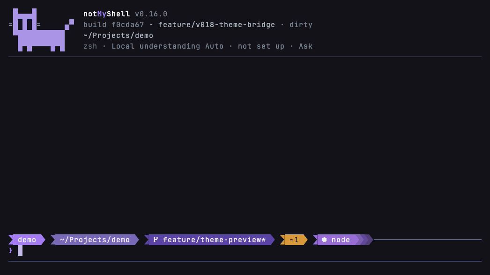

*From input to feedback: a persistent real shell under the NMSh frontend.*

## Customization

Start with Setup Cat, then shape the composer, prompt and colors around the way you work.

### Setup Cat

First launch opens `/setup`; Apply completes discovery. Escape discards the draft and leaves setup pending. Completed and legacy onboarding stays completed, explicit presets bypass discovery, and `/setup` can be reopened anytime.

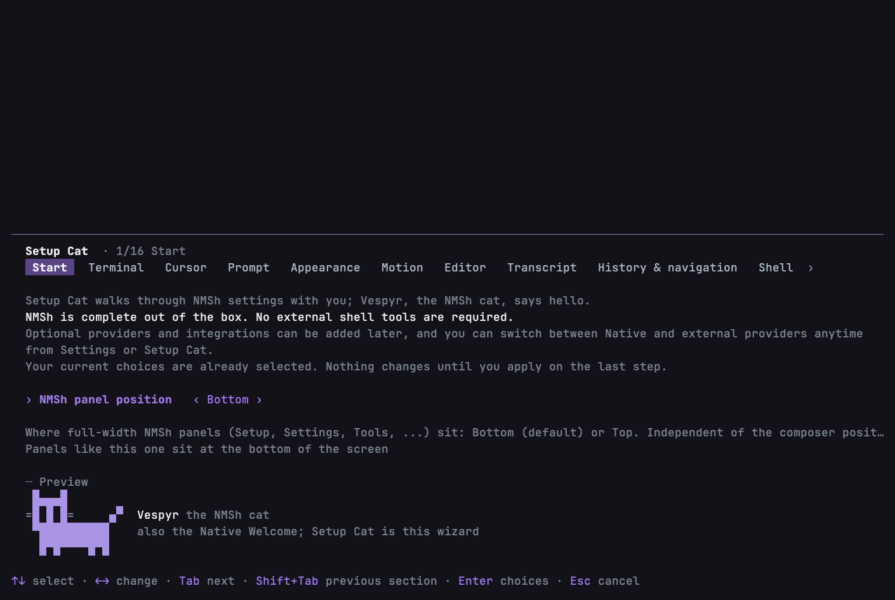

*The same draft-based setup surface on first launch and whenever you return.*

<b>Walkthroughs: composer, themes and syntax</b>

### Composer and prompts

`/prompt` changes the Native prompt to one-line and Soft style; `/layout` moves the composer to Top, then Flow after the newest output. See [prompt customization](architecture/prompt-customization.md).

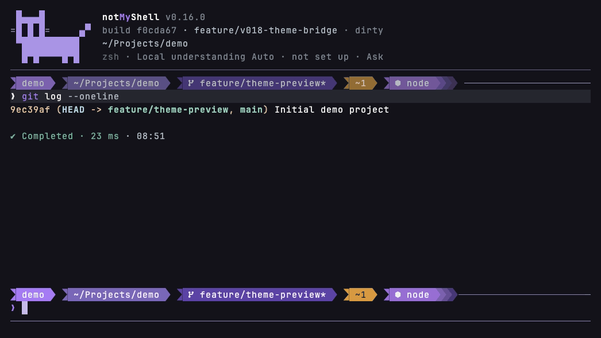

*One editor, different placements: Bottom, Top and Flow.*

### Theme Studio

`/theme` previews built-in themes on the real prompt, interface and syntax roles before applying them, and duplicates one into Custom for editing. See [themes, imports and Theme Bridge](design/theme-bridge.md).

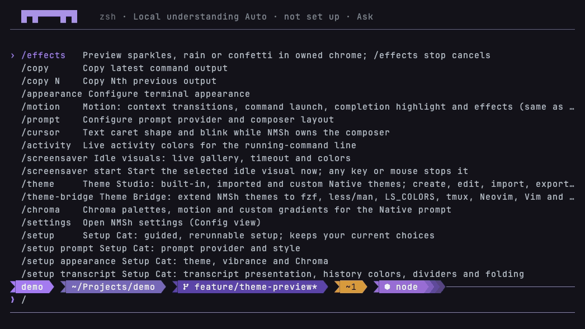

*Browse, preview and edit through one shared theme system.*

### Syntax themes

`/syntax` follows the saved NMSh theme, chooses a family and variant independently, or uses grayscale. Custom appears when a custom theme exists; Catppuccin uses the shared accent from `/theme`. The same role palettes color input and new submitted command lines. Raw output keeps its own colors.

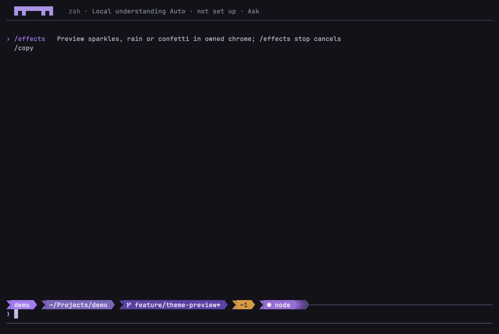

*Family and variant choices with real semantic previews.*

## Color and motion

Color treatments, command feedback and idle scenes share NMSh’s motion controls. Motion remains live in these recordings.

### Chroma gradients

Chroma controls show whether previews are colorized. Turn Chroma Off to see base theme colors. C in `/theme` and P in Setup toggle only the local preview; C in `/prompt` changes its draft. `/chroma` exposes the full controls.

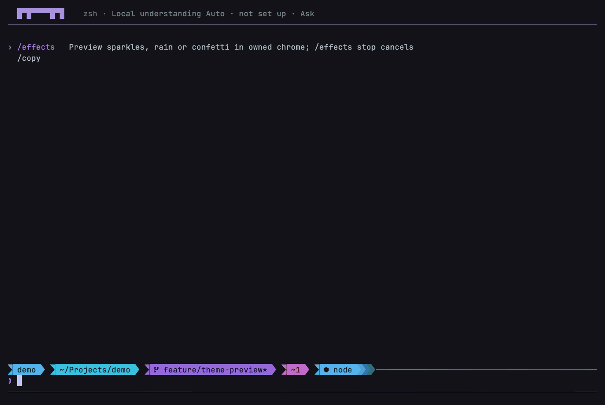

*Change gradient looks, then return to the underlying theme colors.*

<b>Walkthrough: Rich motion and live feedback</b>

### Rich motion and activity

Real commands show live status, completion and failure feedback. `/setup motion` previews Rich rendering for each event without running a command.

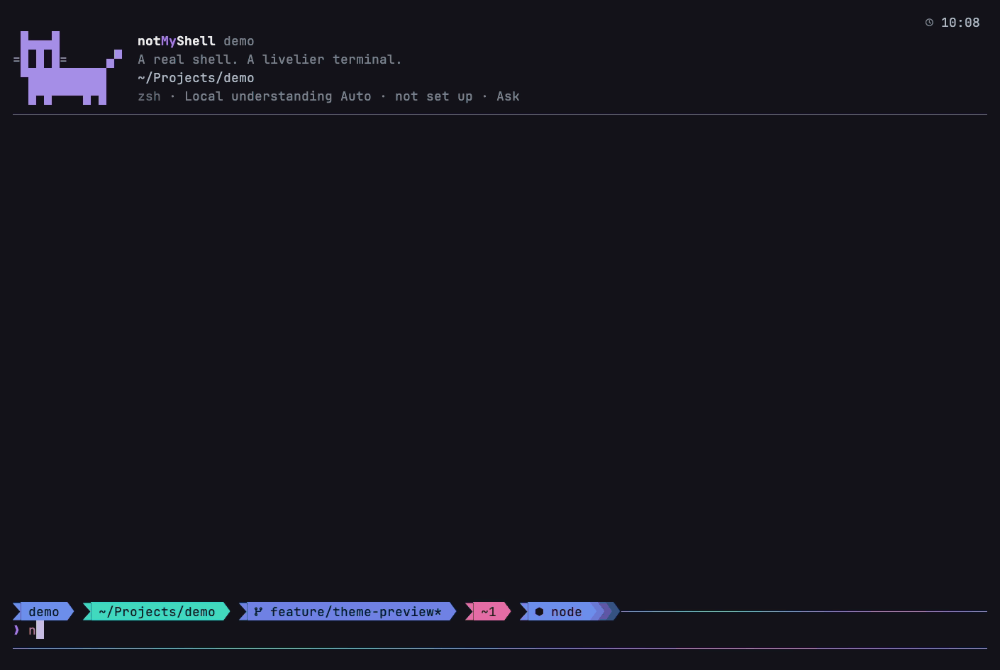

*Command activity and animation previews that give motion a clear purpose.*

<b>Screensaver collection: every named scene</b>

### Screensavers and Vespyr

Every named saver appears below. Random selects among these scenes rather than adding another visual; any key returns to the composer.

#### Atmospheres

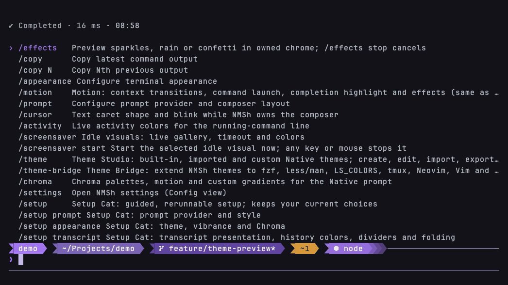

*Aurora Drift → Deep Space → Warp Starfield → Rain.*

#### Sparks and orbits

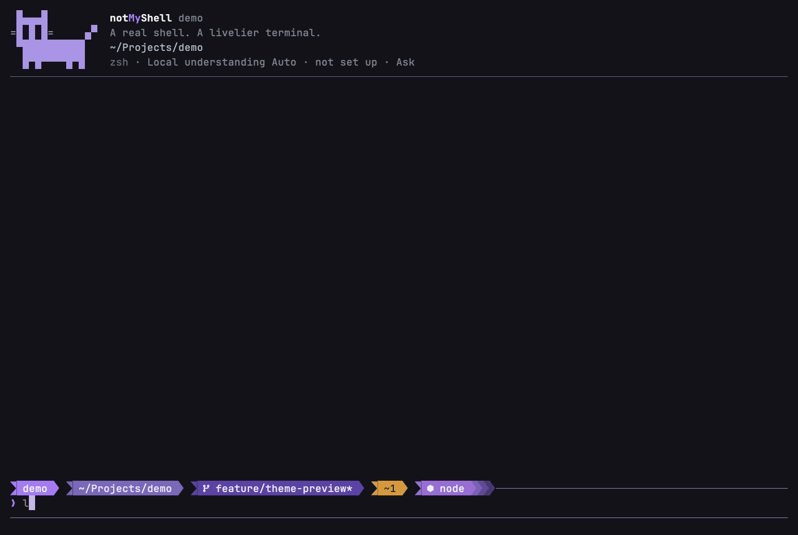

*Sparkles → Night Fireworks → Black Hole → Fireworks → Circletastic.*

#### Vespyr and raiseCatError

*Vespyr’s bounce and the playful raiseCatError scene, with time to see each move.*

## Tools and shells

Choose providers, review tools, ask for local guidance, and use real interactive programs.

### Providers and tools

`/providers` shows each job’s provider inline. `/tools` lists curated tools, project relevance and the exact install plan; Space leaves persistent checked markers as focus moves away. Nothing was installed in the recording.

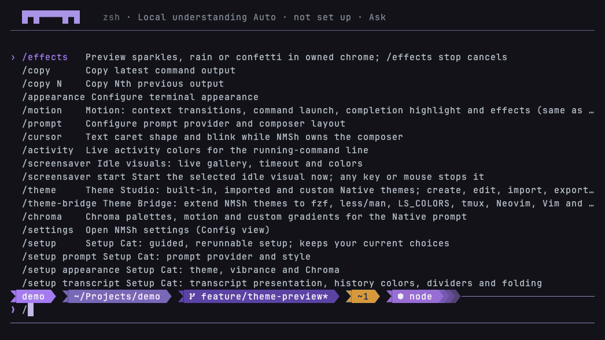

*Choose first, review the plan, then decide whether to install.*

<b>Walkthroughs: Ask, Theme Bridge, Fish and Vim</b>

### Ask and local understanding

`/ask` provides typed local guidance in a conversational surface. `/llm` shows optional local-understanding settings; this recording downloads no model and makes no claim that model inference ran.

*Local guidance and a look at the optional understanding controls.*

### Theme Bridge and integrations

`/theme-bridge` is opt-in and starts with every tool Independent. Each target shows how NMSh would theme it: environment, managed file or detection only. `/integrations` reviews managed-tool health. See [Theme Bridge](design/theme-bridge.md).

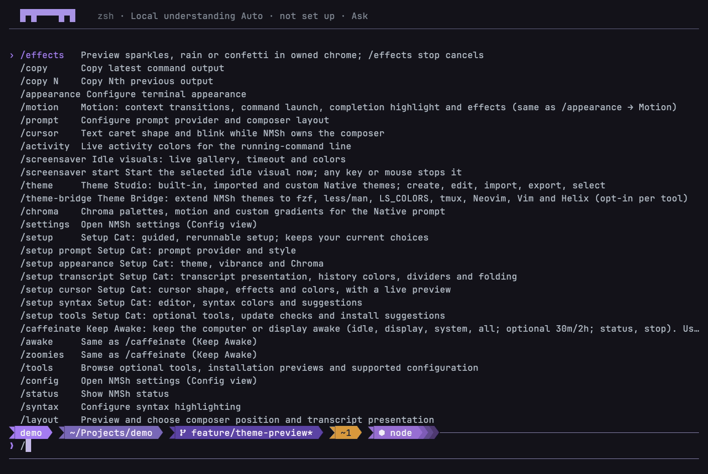

*The control surface and ownership review; external tools are not driven in this clip.*

### Fish and Vim

`/shell fish` switches the existing session while preserving NMSh appearance and archives the old view in `/resume`. A differing shell leads the default Native prompt; customized ordering remains configurable in `/prompt`. Vim uses real passthrough and restores the composer on exit.

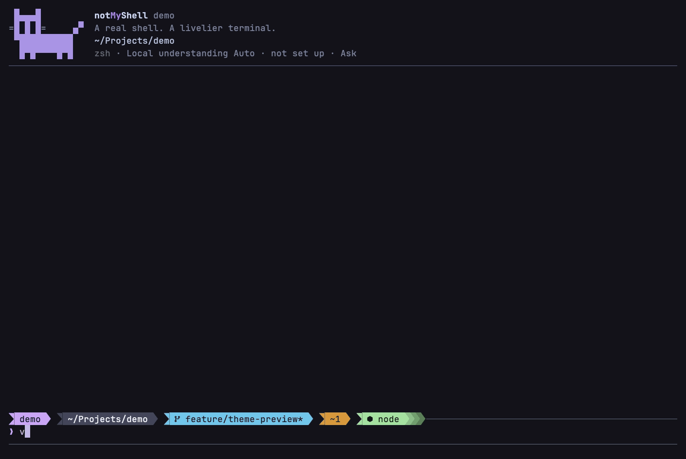

*Real Vim entry/exit, followed by Fish with the NMSh theme preserved. Vim itself is not themed without an enabled Theme Bridge.*

## Sessions

Let a command keep running when the window goes away, then return to the same shell.

### Live sessions

The frontend receives `SIGHUP`, as from a closing window. The build continues; `nmsh` offers the detached session and reattaches with the output that arrived meanwhile.

*Detach during a build and return to its live session.*

<b>Walkthrough: Keep Awake</b>

### Keep Awake

`/zoomies display` starts Keep Awake and immediately returns the prompt. `Awake · Display` appears on a free composer edge and in the Status Strip. The idle reminder adds elapsed time and `/zoomies stop`; stopping removes the presentation. See [Keep Awake](design/keep-awake.md).

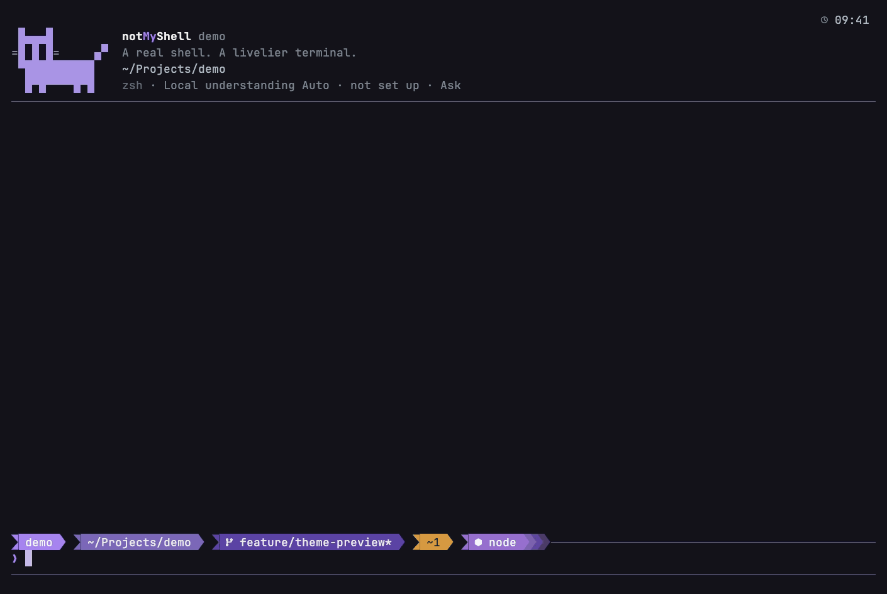

*Recorded with the inert demo backend: the full UI runs without keeping a machine awake.*

---

## Architecture

The simple stack follows the original artwork: terminal host, NMSh frontend and real shell, with Vespyr beside the NMSh title.

<b>Detailed runtime flow: helpers, geometry, sessions and passthrough</b>

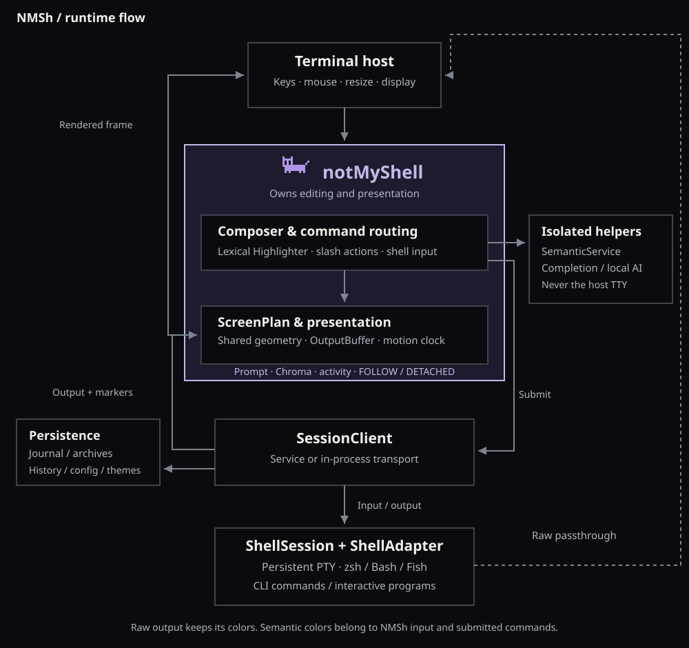

*The same central stack, with supporting services and the raw interactive path shown separately.*

## Stills

Full-size views for inspecting details without motion.

| Composer and Native prompt | Theme Studio | Keep Awake idle reminder |
| --- | --- | --- |
| [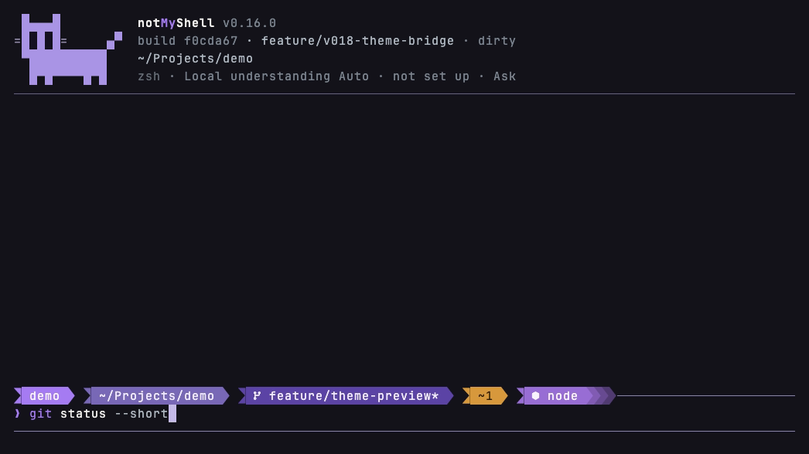](../assets/readme/nmsh-composer.png) | [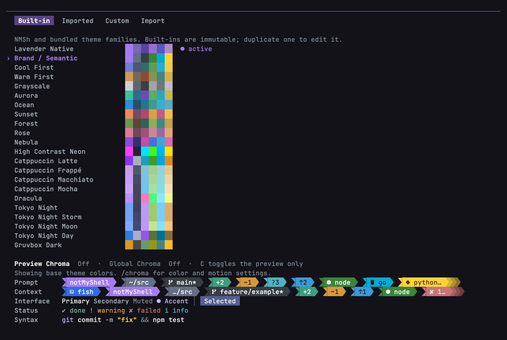](../assets/readme/theme-studio.png) | [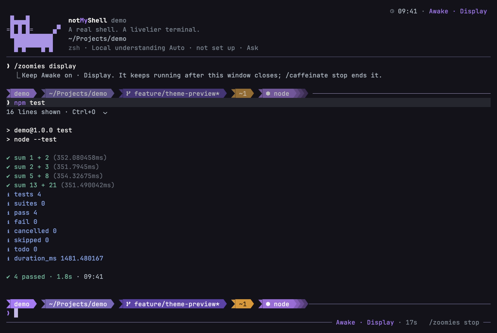](../assets/readme/keep-awake.png) |

[Back to README](../README.md) · [Recording sources](../scripts/demos/README.md)
