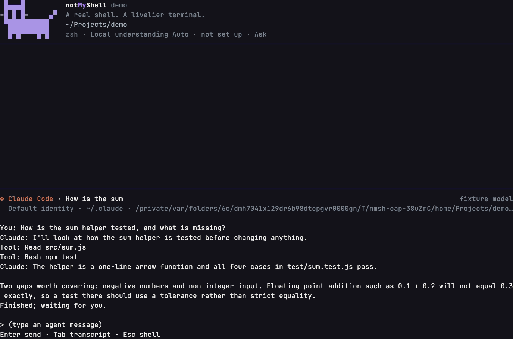
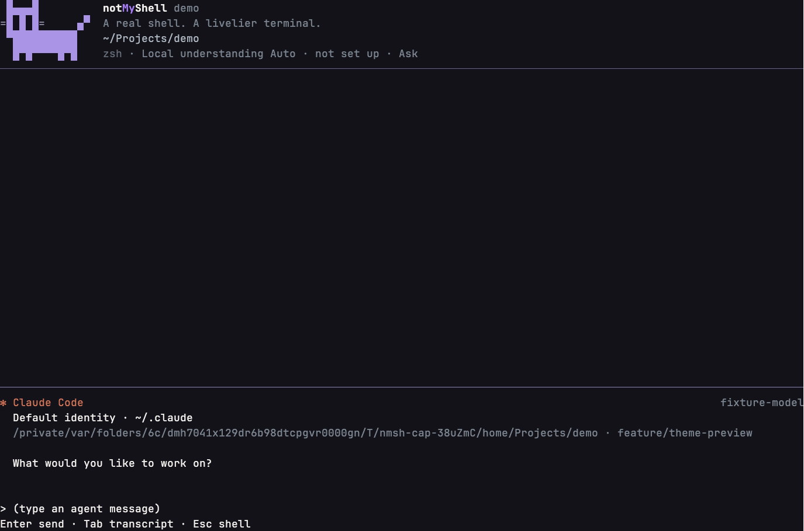
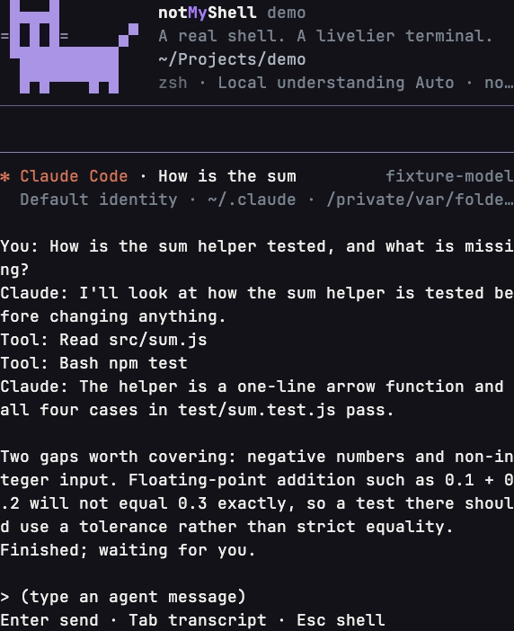
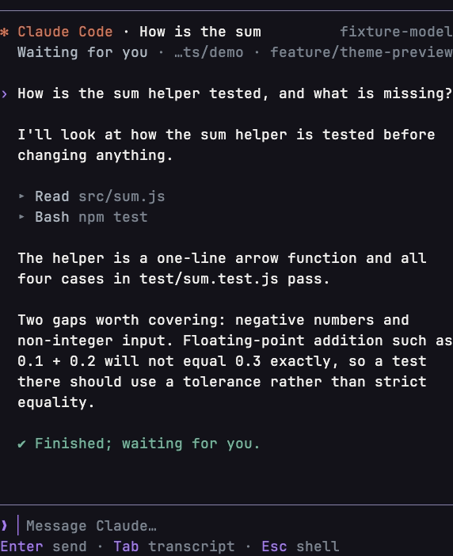
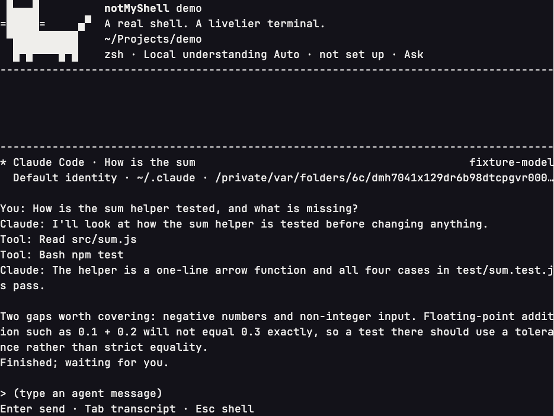
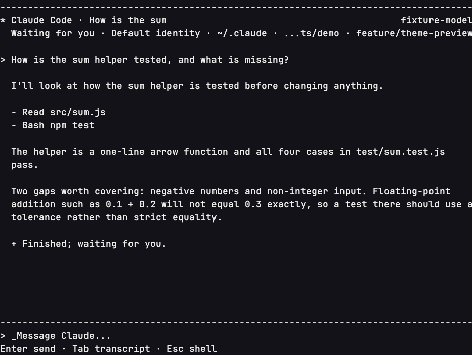

# Managed agent view: presentation polish

Stacked on #329 (`feature/claude-agent-ui` at `164ec48`). A focused presentation slice: the active-agent header,
the conversation hierarchy, the composer and the view's use of vertical space. Provider events, approval and
question routing, session identity, semantic zoom, transcript source, copy and the separate agent/shell drafts
are unchanged.

## What changed

- **The view owns its height.** The agent view is a workspace: it fills the screen below its frame line
  (`TerminalApp` passes `rows - 1` instead of `rows - 4`), the conversation runs down from the header and the
  composer keeps the bottom edge. Previously the panel was only as tall as its content, so the shell's welcome
  header and Vespyr stayed above an accidental empty band.
- **Compact header.** Row 1 is unchanged (provider · title, the runtime model on the right). Row 2 now leads with
  the target's state, then the launch identity and place. Narrow widths drop the identity first, then the branch,
  then the start of the path. The project folder name and the state are always kept. The person's home reads as `~`
  for any `$HOME`.
- **Conversation hierarchy.** User turns lead with an accent marker (`›`, Safe `>`). The agent's prose is the body,
  indented under it. Tools are quiet rows (`▸ Read src/sum.js`, Safe `-`), with failure in words. Outcomes use the
  shared success/failure glyphs. Blank rows separate turns and set prose apart from activity, and consecutive tools
  stay together. There are no repeated `You:`/`Claude:`/`Tool:` prefixes.
- **Word wrap with hanging indents.** Wrapping is by display cells, at word boundaries. Only words wider than the
  line hard-break. Before, lines split mid-word ("missi / ng").
- **Composer.** A single separator rule sits above the composer, which uses the shared prompt glyph. The draft is
  rendered as edited (paste atoms by label), with a caret at the real cursor, continuation rows aligned under the
  text, and drafts longer than five rows collapsing to "N earlier lines". The placeholder reads
  `Message Claude…`.
- **Controls.** The footer uses the shared `renderControls` styling (keys in accent, actions muted). `Ctrl+C
  interrupt` appears only while the target is working or awaiting approval. Controls are dropped whole when narrow,
  never cut, and the question controls wrap at control boundaries (`renderControlRows`). Approval and question
  notices carry the shelf's attention glyph (`◆`, Safe `!`) as well as words.

## Unchanged on purpose

- No new capability or provider fact is shown. The model is shown only as the provider reported it, or as configured.
- Copy (`c`/`C`, `/copy`) still projects the transcript source. Presentation markers never enter copied text or
  history.
- The legacy non-semantic `renderAgentView` path, the shelf, the launcher, `/ai` and `/mods` are unchanged.
- No sidebar, right panel, theme overhaul or new key dispatch.

## Evidence

The captures come from real terminal recordings of the built product (VHS frames, same fixture provider, same
disposable home, same dimensions before and after). They are produced by
`scripts/probes/agent-view-capture/capture.mjs <repo> <outdir> <width> <height> <label> [ENV=value,...]`.
The fixture provider (`fake-claude.cjs`) speaks Claude's stream-json shape with fixed content. It is not the real
provider, and the `fixture-model` label is its reported model.

| | Before | After |
|---|---|---|
| Conversation, 1440×960 |  |  |
| Welcome, 1440×960 |  |  |
| Conversation, narrow 640×760 |  |  |
| Safe glyphs + NO_COLOR |  |  |

Physical terminal QA (Ghostty, real Claude account, custom themes, live resize) remains pending.
