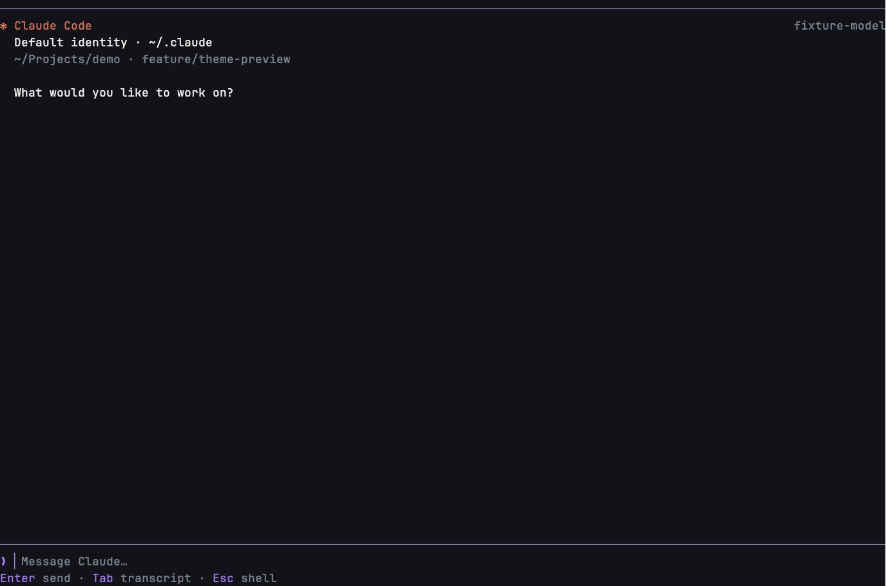
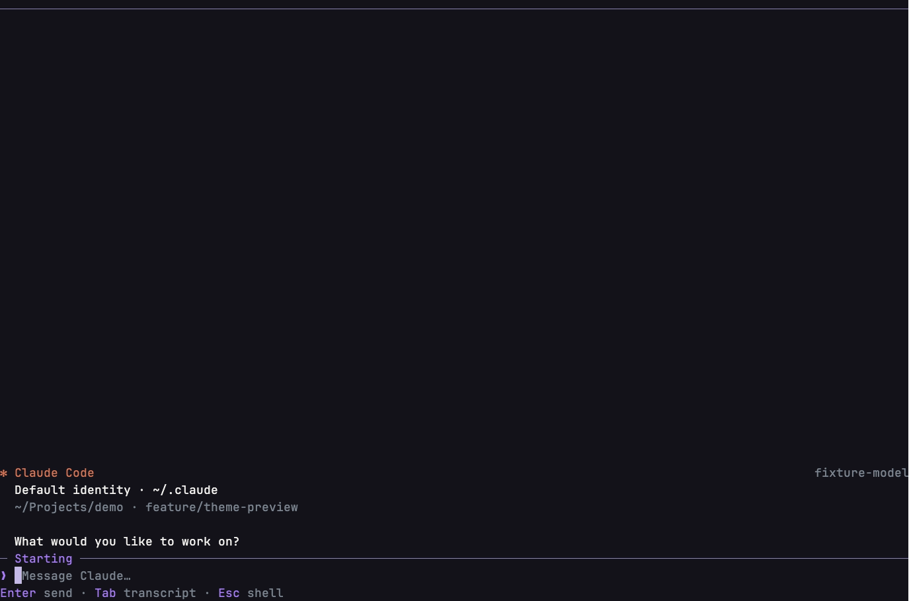
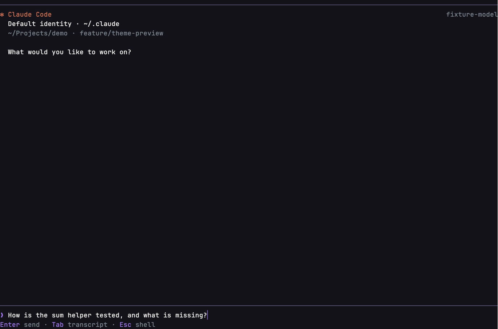
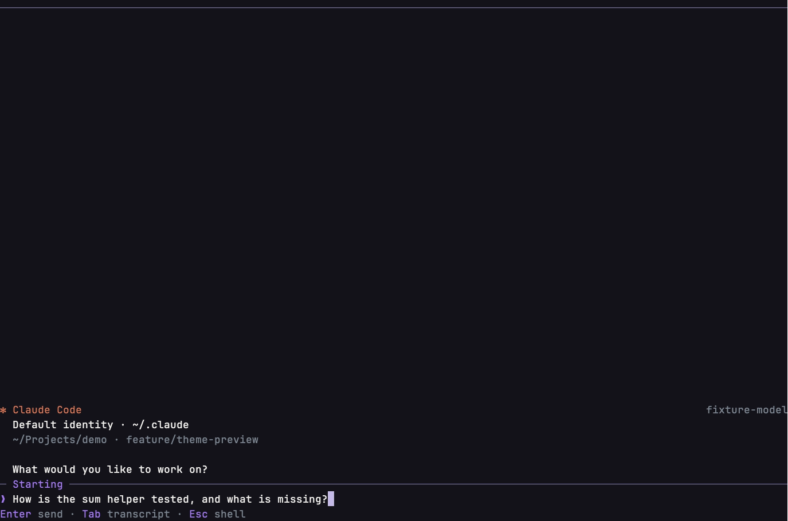
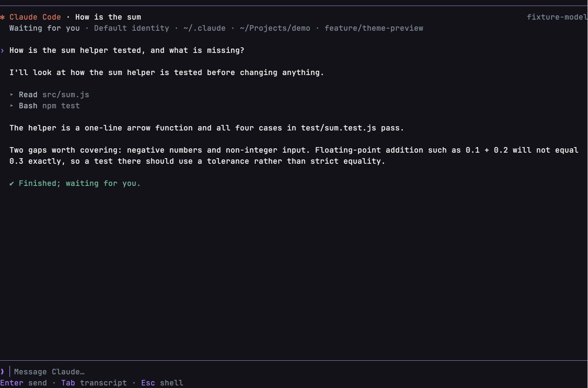
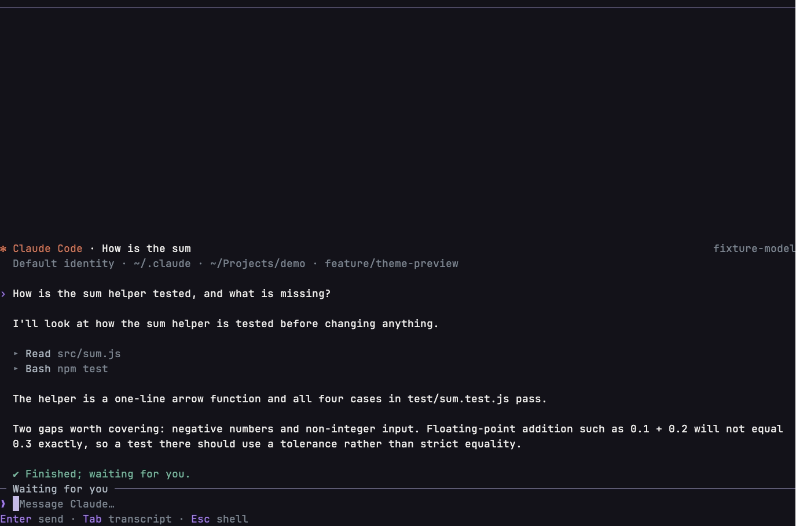
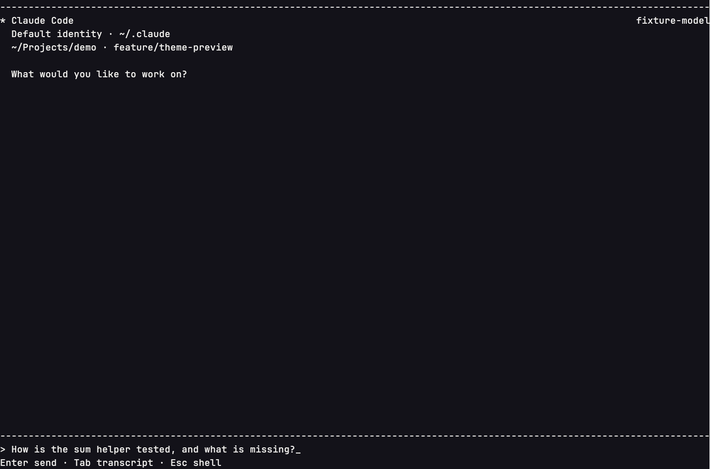
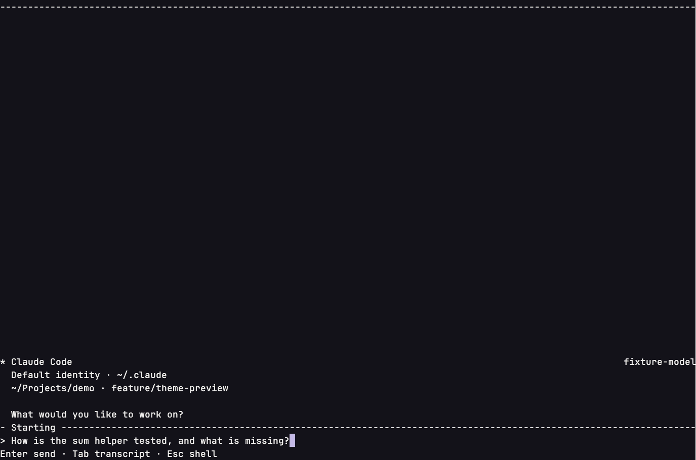
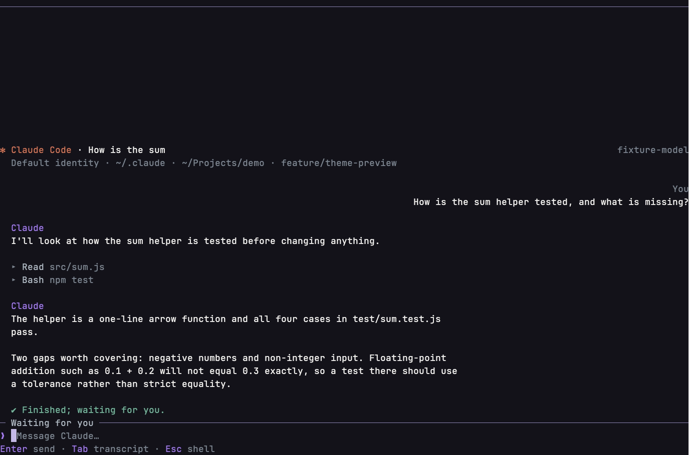
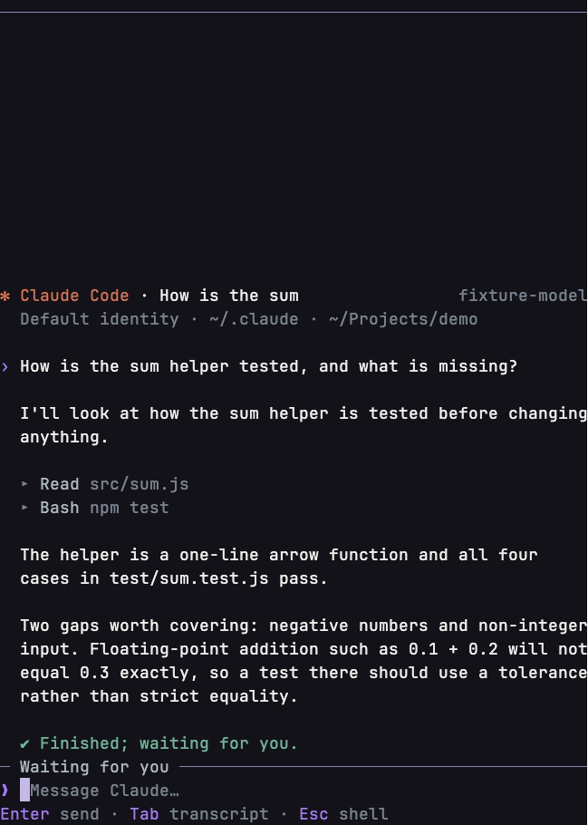

# Managed Claude: conversation workspace and caret

Follow-up to the agent view polish (#344), found in physical QA on the v0.18.0 candidate: the `/claude` draft had no
visible caret, and a fresh session's welcome sat far above the composer.

## Caret

The agent draft is laid out by the shell composer's own geometry (`layoutInput`: prompt prefix, continuation indent,
cell wrapping and caret cell). The view reports the caret's row and column; TerminalApp places the terminal's own
cursor there through the same frame cursor and `CursorPresenter` path as the shell composer, so caret shape, color
and effects follow `/cursor`. No caret glyph is painted, so there is never a second caret. Up and Down move between
the draft rows at the width that was drawn. There is no text caret while an approval, a question or transcript focus
owns the keys; leaving the view returns the caret to the shell input and its draft.

## Layout

The conversation is a stream that meets the composer: a compact welcome (provider, reported model, identity, folder
and branch) rests on the composer rule and gives way as turns arrive; the target's state rides that rule. A
scrolled-back view stays put when new rows arrive, and scrollback reaches the first turn. Normal and Chat follow the
transcript presentation setting: in Chat your turns are right-aligned and labelled, and the agent's prose is a
named left column. Composer Top puts the composer first with the conversation below it.

## Evidence

Real terminal recordings (VHS) of the built product with the fixture provider (`fake-claude.cjs`), before
(candidate `f874e21`) and after, at 1440 x 960 unless noted. Not physical Ghostty QA.

| | Before | After |
|---|---|---|
| Fresh session |  |  |
| Typing |  |  |
| Conversation |  |  |
| Safe glyphs, NO_COLOR |  |  |

After, Chat:  · 720 px: 
