# /mods: native NMSh menu

Follow-up from #329 (`feature/claude-agent-ui` at `164ec48`). This is presentation only. Mod discovery, the broker,
provider logic and the controller's keys, filters, search, details, scrolling, refresh and focus are unchanged.

## What changed

- **Shared NMSh primitives instead of a field dump:**
  - `renderTabStrip`: the active tab is a filled block; it is reverse video without color.
  - A `Search` / `Provider` row, in the same pattern as `/tools`.
  - `groupLines`/`groupedWindow` group headings: portable descriptors, Context Packs, and each provider with its
    launch profile.
  - `selectedRowBand`: a pointer plus the band, reverse video without color.
  - A contextual `renderControlRows` footer that wraps at control boundaries.
- **Browse, then inspect.** Rows show the name, one factual state word (`enabled`, `disabled`, `state unknown`, or
  `inert` for portable descriptors) and the scope and version. The selected entry's execution facts stay visible
  below the list and wrap, never truncate. Enter opens the full record: **Execution** (runs where, sandbox,
  managed, permissions, and grants for portable descriptors), then **Provenance** (installed by, source, scope and
  profile, version, location, evidence, trust).
- **Accurate classes.** Provider-native entries "run inside Claude Code · no NMSh sandbox · not managed by NMSh".
  Portable descriptors are "inert · not executable · no privileges granted". Context Packs are "declarative · not
  executable". Nothing implies that an NMSh sandbox exists. Trust always reads as unknown.
- **Narrow widths.** The subtitle shortens by whole clauses, and rows keep the name and a short state word. The risk
  summary wraps. The tab strip windows around the active tab with `‹ ›`.
- **NO_COLOR.** The shared tab strip's active tab now uses reverse video (before, only weight), matching the
  selected-row band. Colored output is unchanged.

## Unchanged on purpose

Discovery (`claudeDiscovery`, `inventory`), `broker`, `model`, `controller`, `TerminalApp` routing and the panel
height (`rows - 4`, shared by every panel, which is why the shell's welcome shows above the menu).

## Evidence

Real VHS terminal frames of the built product, with the same disposable home and fixture provider before and after.
The fixture provider answers `claude plugin list --json` with three fixed plugins, and the project declares one hook.
Column counts were calibrated with `tput cols` at each width: 950 px = 80, 1385 px = 120, 615 px = 50.
Harness: `scripts/probes/mods-capture/capture.mjs <repo> <outdir> <width> <height> <label> [ENV=value,...]`.

| | Before | After |
|---|---|---|
| 80 columns, browsing | 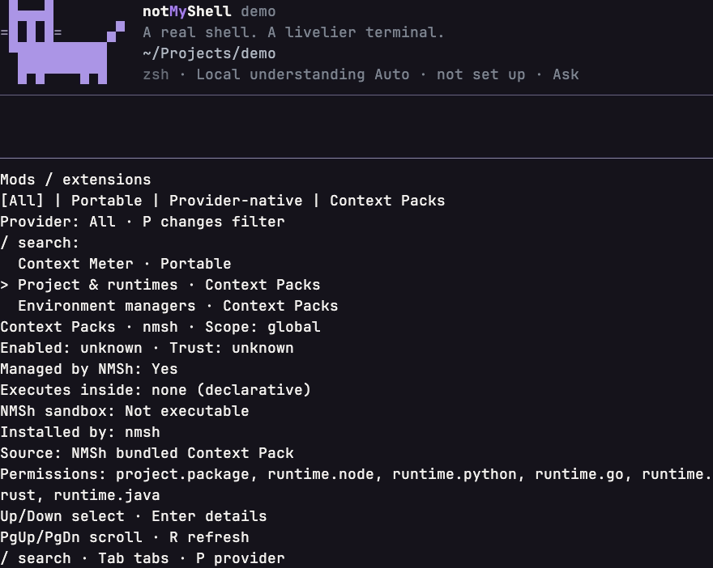 | 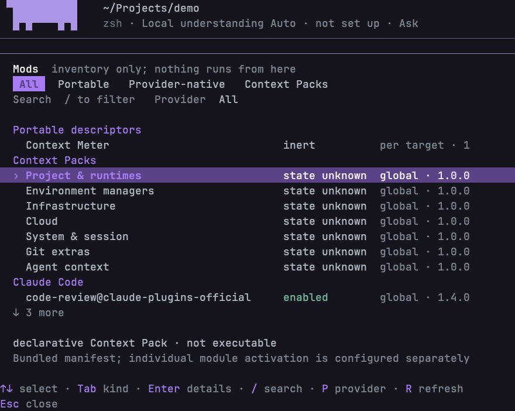 |
| 80 columns, details | 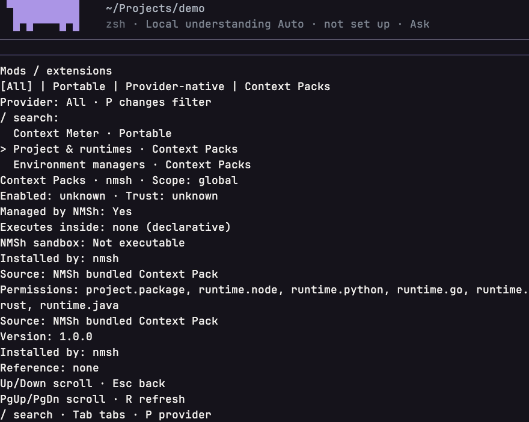 | 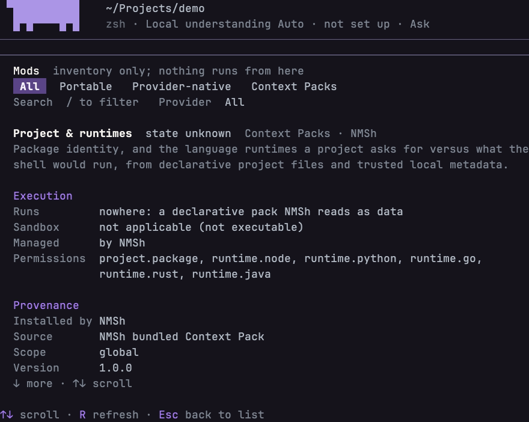 |
| 120 columns, Provider-native tab | 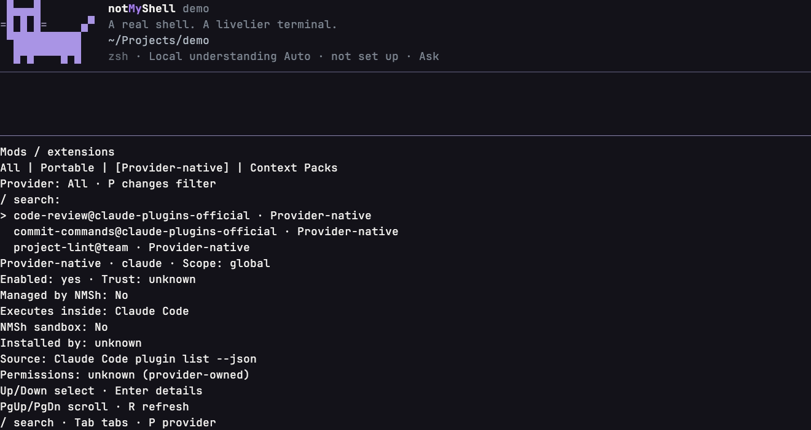 | 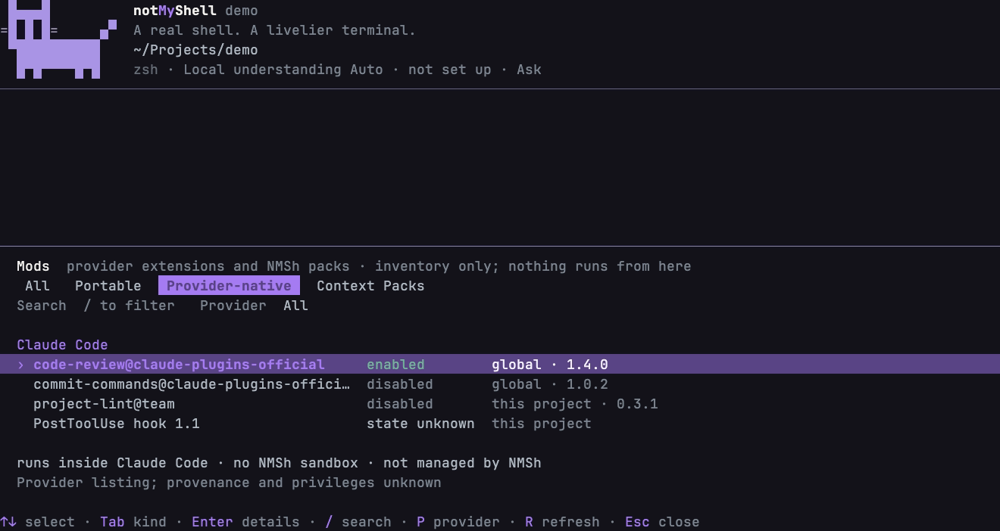 |
| 50 columns, Provider-native tab | 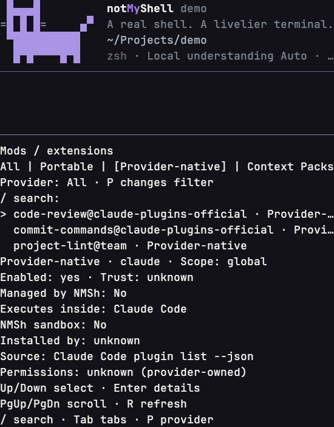 | 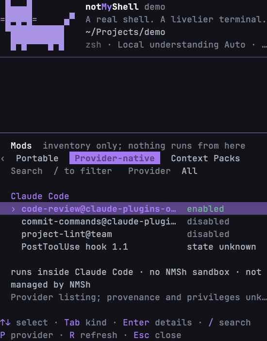 |
| 50 columns, details | 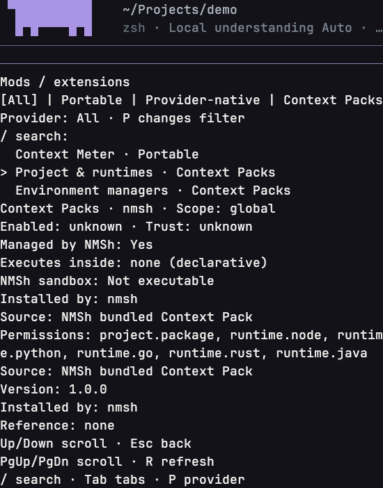 | 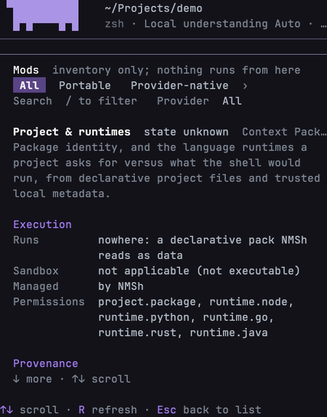 |
| 80 columns, Safe + NO_COLOR | 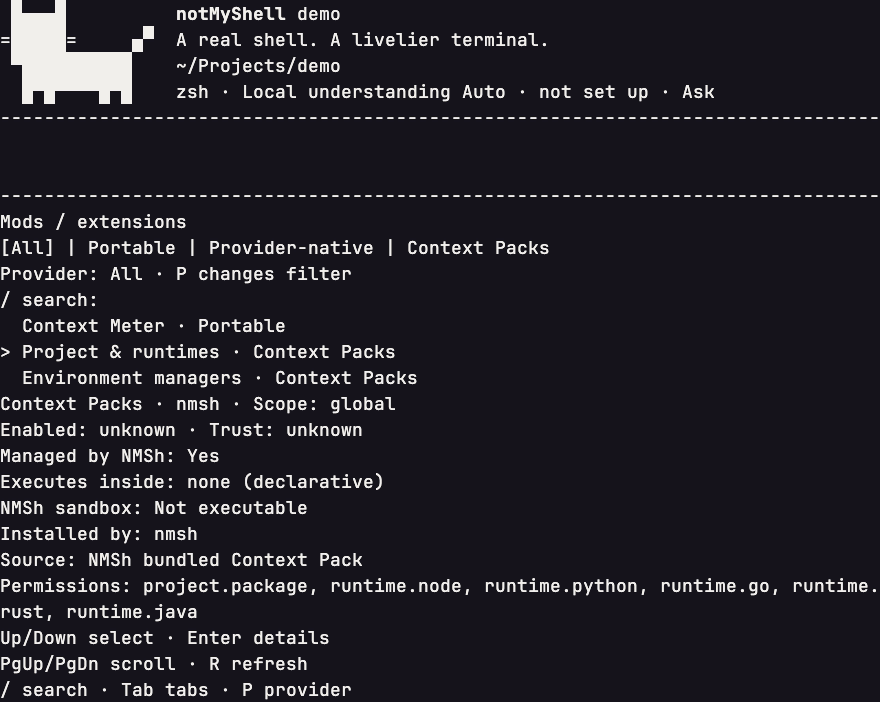 | 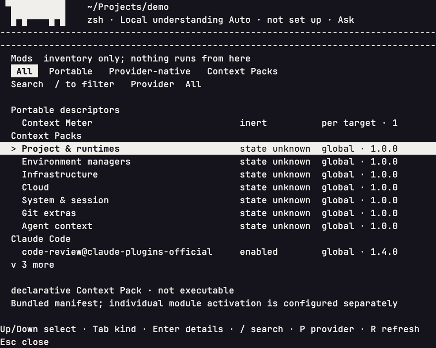 |

Physical terminal QA (Ghostty, real plugin inventories, custom themes) remains pending.
